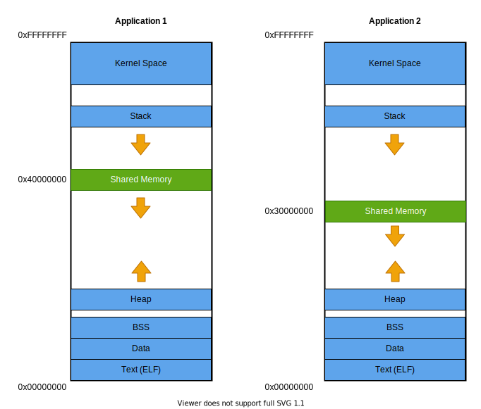

<!-- @todo Move the content of this file to website/getting-started/overview.md or website/for-developers/* -->

# Structure of an iceoryx system

An iceoryx system consists of:

* One RouDi Daemon
* N processes that have a "Posh Runtime"

## The RouDi Daemon
RouDi (''Rou''ting and ''Di''scovery) is the core of the system and is responsible for:

* **Service discovery:**
RouDi is the central resolution point for publishers and subscribers
* **Shared memory management:**
RouDi initializes shared memory segments used by the system and arbitrates memory allocation
* **System introspection:**
RouDi has full knowledge of the existing ports in the system, their connections and their memory usage.
It provides facilities for applications to query this information.

It can be thought of as the "management server" of the iceoryx system. An instance of RouDi must be running in any
iceoryx system.

RouDi uses the modules of the Posh library to fulfill its function.

## The Posh Runtime
A Posh runtime is a running entity with its own isolated memory space that participates in the iceoryx system.
In a POSIX system, a Posh runtime and a POSIX process have a one-to-one mapping.

A Posh runtime may offer services to the iceoryx system or discover services offered by other runtimes to interface with.

The services offered by Posh runtimes communicate via events and the event flow is reasoned about using
publish-subscribe semantics.
A service must be explicitly registered with RouDi to participate in communication.

# Shared Memory Management
## The Basics
When a process in a POSIX system starts it is given its own virtual address space.

The range that a virtual address space spans may be the same for different processes, however the data that is
accessible at a particular address may be different for each process.

A pointer in an application uses the virtual address space of the process it is running in.

Within the virtual address space of a process there are a number of "memory areas" to where data is loaded or mapped.
These memory areas are typically disjointed ranges in the process's virtual address space.
Some examples of what may be in a memory area are:

* The execution instructions of the running program (i.e. the program's `.text` segment)
* Static variable declarations (i.e. the programs `.data` segment)
* The execution instructions of a shared library used by the running program (the libraries `.text` segment)
* The process's stack
* The process's heap
* **Shared memory segments**

A shared memory segment is physical memory that lies somewhere foreign to a process (i.e. in some section of RAM or on
the file system) that is made accessible via a mapping to a memory area in their virtual address space.

A single segment may be mapped to multiple processes, however the addresses to which it is mapped to may be
(and probably will be) different between processes.

The POSIX API provides the [utilities](http://man7.org/linux/man-pages/man7/shm_overview.7.html) for working with
shared memory segments.

## Organization
An iceoryx system utilizes one "management" segment for administration purposes and any number of "user" segments for
event communication between services.

These segments are logically partitioned into "mempools". Mempools contain a number of equally sized "memory chunks".

Memory chunks are the basic unit used for shared memory access in an iceoryx system.

The number of segments used by an iceoryx system, along with the configuration of the mempools they contain, are
provided to the system via configuration.

The configuration can be provided at compile time (as a header) or at runtime (as a toml-formatted text file).
See the [configuration guide](https://github.com/eclipse-iceoryx/iceoryx/blob/master/doc/website/advanced/configuration-guide.md#configuring-mempools-for-roudi) for more details.

# Communication Mechanisms
In this section we will have a look at the concepts employed to structure the communication between
services in an iceoryx system.

## Ports
A port is an entity that represents data flow. There are different types implemented in iceoryx which differ based on
the information that they carry and how they are used by iceoryx.

Existing ports include:
* `PublisherPort` - used by services to output arbitrary data required for their function
* `SubscriberPort` - used by services to receive arbitrary data from other services
* `InterfacePort` - used by gateways to receive information about a local iceoryx system  that is required to interface
with remote iceoryx systems (see below for more on gateways)

Data flow between services in a local iceoryx system is described  using connections between publisher and subscriber
ports.

A `Publisher` in an iceoryx system publishes data via a `PublisherPort`, and likewise, a `Subscriber` receives data
via a `SubscriberPort`.

## Service Discovery / Port Wiring
Matching `Publisher`s with `Subscriber`s in iceoryx is achieved by connecting their underlying `PublisherPort`s and
`SubscriberPort`s.

Connections between `PublisherPort`s and `SubscriberPort`s are established using service descriptions which are composed of:
* A service id - identifies the type of service
* A service instance id - identifies an instance of a service
* An event id - identifies an output from a service

All `PublisherPort`s and `SubscriberPort`s are created with a service description.
The system will automatically connect ports with matching service descriptions.

The order that ports appear in is not a factor.
Existing `SubscriberPort`s will automatically connect to `PublisherPort`s that appear at a later time if their service
descriptions match (and vice versa).

Additionally, information about the existing `PublisherPort`s in the system are relayed on `InterfacePort`s. This allows
for the entities using these ports (i.e. Gateways) to hook into the data streams of a local iceoryx system and create a
bridge to foreign iceoryx systems.

## Zero-copy Interservice Communication
`PublisherPort`s and `SubscriberPort`s which are wired together can communicate via shared memory resulting in zero-copy
communication.

A `PublisherPort` has an assigned shared memory segment to which it may write its data to. In a POSIX system,
this is decided purely based on file access permissions as memory segments are represented as virtual files.

To output data, a `PublisherPort` reserves a memory chunk in its assigned memory segment.
The iceoryx system will intelligently choose the smallest chunk size that can fit the output data structure.
Note that an entire chunk is reserved even if the data type it contains is smaller than its size.

A `PublisherPort` chooses explicitly when to deliver data written in a memory chunk to all of its attached `SubscriberPort`s
(established via discovery). When this occurs, a pointer to the memory chunk is placed on a receive queue at the
`SubscriberPort`.
The `SubscriberPort` can then access the data at its own convenience by following the pointer.

A `SubscriberPort` must explicitly indicate when it has finished processing a particular memory chunk it has received.
Memory chunks are returned to the pool once all attached `SubscriberPort`s indicate they have finished.

### A Note on Pointers
As already discussed, shared memory segments may be mapped to different memory areas in the virtual address space of a
process.
To deal with this, iceoryx utilizes specialized pointer types: the `iox::rp::RelativePointer` and
the `iox::rp::RelocatablePointer`.

Using these types, the difference in memory mapping is not a factor when it comes to locating a memory chunk.

A more detailed discussion about how these types work can be found
[here](design/relocatable_pointer.md).

## Internode Communication
Separate iceoryx systems residing on different hosts can be networked together via "Gateways". Gateways are responsible
for synchronizing data published on `PublisherPort`s between iceoryx systems residing on different hosts that are networked
together.

## Logging and Error Handling
Iceoryx uses its own logger which is based on the Autosar **ara::log** API. For safety reasons it defines its own error handler to deal with errors (instead of using e.g. exceptions).
Details of the error handling concept can be found in [error-handling.md](./design/error-handling.md).
