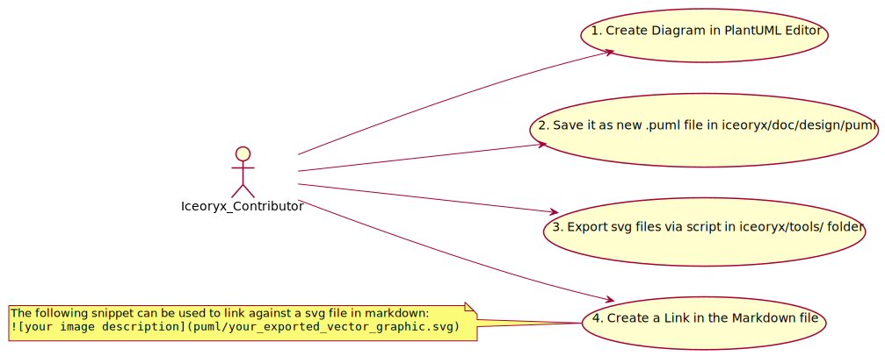

# Design Documents

In here you can find design documents to all constructs of iceoryx. At the
moment those design documents are neither complete nor final.

Under [draft](./draft/README.md) are design drafts of features stored which are currently under
development. The goal is to provide fellow developers a first idea on how
the feature can be used and how it will be implemented.

## Add diagrams using PlantUML

Diagrams in the design documentation can be done with [PlantUML](https://plantuml.com/).
For using PlantUML we recommend using the latest version with the following required packages:

 * `default-jre-headless`
 * `graphviz`

A good online-editor with cheat-sheet can be found at [https://plantuml-editor.kkeisuke.com](https://plantuml-editor.kkeisuke.com).
Alternatively you can use extensions in your IDE.

The integration of the generated PlantUML into your design documents is done via *.svg files.
You need to create a .puml file and export it to .svg afterwards for linking it with the markdown. In the `tools` folder is a [helper script](../../tools/scripts/generate_plantuml_svg.sh) provided which downloads a defined version of PlantUML to export the vector graphics.
These steps are necessary due to the current support of PlantUML in [Github](https://github.community/t/support-uml-diagrams-in-markdown-with-plantuml-syntax/626).

**NOTE:** Don't set parameter for theming (like background color) directly in individual puml files but use the central `doc/iceoryx-plantuml-config.puml` which is shared with all diagrams.

This is an example how to render PlantUML in Github:

workflow using svg file:

