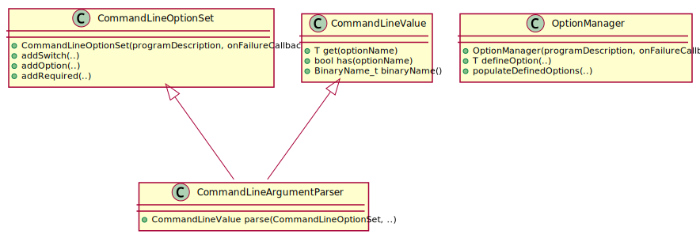
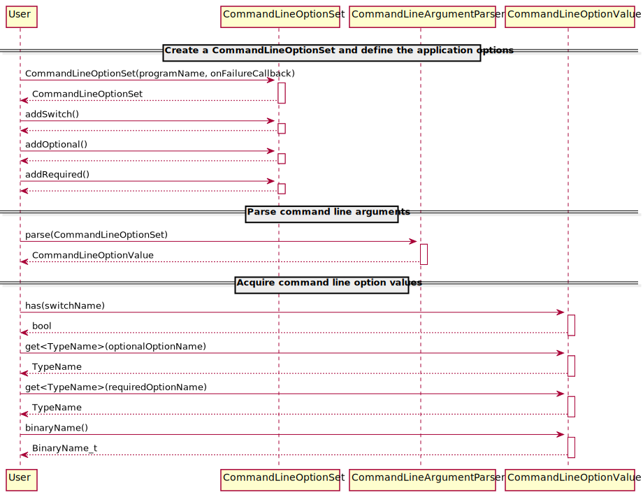
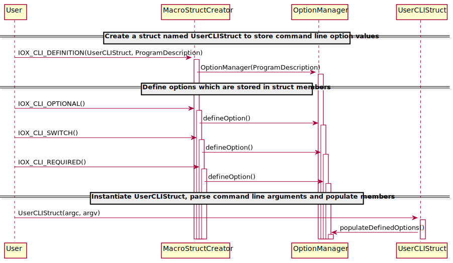

# Command Line Parser

## Summary

For command line parsing the POSIX `getopt` and `getopt_long` are available.
Those functions have several downsides:

 * Are not available on all platforms (Windows).
 * Are error prone to use. The user has to consider all conversion edge cases
    and verify the syntax.
 * Are hard to use and the API is hard to read.
 * One has to write a lot of code to use them, even for minimal problems.
 * How the help is shown, how the help is formatted and certain syntax decision
    can vary from binary to binary in iceoryx. A unified appearance and usage
    across all applications would increase the user experience.

Since we would like to offer command line support on all platforms we either
have to rewrite `getopt` and `getopt_long` from scratch or write a modern C++
alternative.

## Terminology

The terminology is close to the terminology used in the POSIX.1-2017 standard.
For more details see
[Utility Conventions](https://pubs.opengroup.org/onlinepubs/9699919799/basedefs/V1_chap12.html).

Assume we have a iceoryx tool with command line arguments like:
```
iox_tool -a --bla -c 123 --dr_dotter blubb
```

| Name              | Description                                              |
| :---------------- | :------------------------------------------------------- |
| argument          | A chain of arbitrary symbols after the command. Arguments are separated by space. Examples: `-a`, `--bla` |
| options           | Arguments which start with a single dash `-` or double dash `--`, like `-a` or `--bla`. |
| short option      | Argument which starts with a single dash followed by a non-dash symbol, like `-a` or `-c` |
| long option       | Argument which starts with double dash followed by at least another non-dash symbol, like `--bla` or `--dr_dotter` |
| option name       | The symbols after the leading dash of an option, for instance `a` or `dr_dotter`. |
| option argument   | Argument which is separated by a space from an option, like `123` or `blubb`. |
| argc & argv       | Taken from `int main(int argc, char* argv[])`. Provides access to the command line arguments. |

### Option Types

| Name              | Description                                              |
| :---------------- | :------------------------------------------------------- |
| switch            | When provided as argument the switch is activated, see `-h` and `--help`. A boolean signals to the user whether the switch was provided (activated) or not. |
| optional          | A value which can be provided via command line but is not required. Every optional option requires a default value. |
| required          | A value which has to be provided via command line. Does not require a default value. |

Every option has an option argument but since the switch is boolean in nature
the argument is implicitly provided when stating the option.

## Design

### Considerations

The solution shall be:

 * easy to use by the developer
 * provide a unified appearance and syntax in all applications with command line arguments
    * the help must be generated by the parser
    * the help shall contain the type if an argument requires a value
    * the syntax is defined by the parser not the developer as much as possible
 * shall be type safe when command line arguments are converted to types like `int` or `float`
    * underflow, overflow shall be handled
    * a detailed error explanation shall be presented to the user when cast fails

### Solution

#### Class Diagram

The `CommandLineParser` takes an `OptionDefinition` and parses
the raw command line arguments (`argc` and `argv`) based onto the `OptionDefinition`
into `Arguments` which can be used to access the values of those options.



#### Sequence Diagram

Lets assume we would like to add a switch, an optional and a required option, parse
them and print them on the console.



#### Macro Based Code Generator

```cpp
struct UserCLIStruct
{
    IOX_CLI_DEFINITION(UserCLIStruct, "My program description");

    IOX_CLI_OPTIONAL(string<100>, stringValue, {"default Value"}, 's', "string-value", "some description");
    IOX_CLI_REQUIRED(string<100>, anotherString, 'a', "another-string", "some description");
    IOX_CLI_SWITCH(uint64_t, version, 0, 'v', "version", "print app version");
};

// This struct parses all command line arguments and stores them. In
// the example above the struct provides access to
//   .stringValue()
//   .anotherString()
//   .version()
// Via the command line parameters
//   -s or --string-value
//   -a or --another-string
//   -v or --version

int main(int argc, char* argv[]) {
  UserCLIStruct cmd(argc, argv);
  std::cout << cmd.stringValue() << " " << cmd.anotherString() << std::endl;
}
```

The macros `IOX_CLI_DEFINITION`, `IOX_CLI_SWITCH`, `IOX_CLI_OPTIONAL` and `IOX_CLI_REQUIRED`
provide building blocks so that the user can generate a struct. The members of that
struct are defined via the macros and set in the constructor of that struct which
will use the `OptionManager` to parse and extract the
values safely.



The struct constructor can be called with `argc` and `argv` as arguments from 
`int main(int argc, char* argv[])`.


## Open issues

Our `iox` tool should be structured similar like the `ros2` tool. This
means `iox COMMAND ARGUMENTS_OF_THE_COMMAND`. The current implementation allows us
only to parse the `ARGUMENTS_OF_THE_COMMAND` but not handle the `COMMAND` in an easy manner.

A follow up pull request will address this issue.

The structure will look like the following (taken from proof of concept):
```cpp
struct Command {
    iox::string command;
    cxx::function<void(int, char**)> call;
};

// this generates a help with an overview of all available commands which can
// be printed with --help or when a syntax error occurs
bool parseCommand(argc, argv, const vector<Command> & availableCommands);

void userDefinedCommand1(argc, argv) {
    // here we use the already implemented CommandLineStruct to parse the
    // arguments of the command
    // The CommandLineStruct generates the help for the command line arguments
    // of that specific command
}

void userDefinedCommand2(argc, argv) {
}

int main(int argc, char* argv[]) {
    parseCommand(argc, argv, {{"command1", userDefinedCommand1},
                              {"anotherCommand", userDefinedCommand2}});
}
```

The idea is to handle every command independently from every other command and
do not define everything in one big command line parser object which would
violate the separation of concerns.
