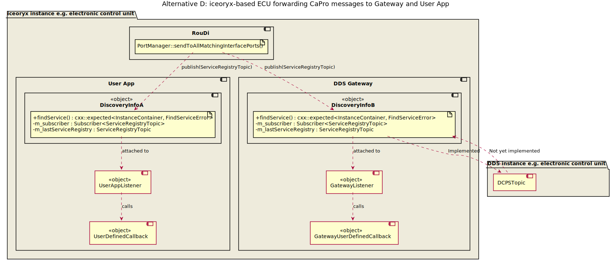
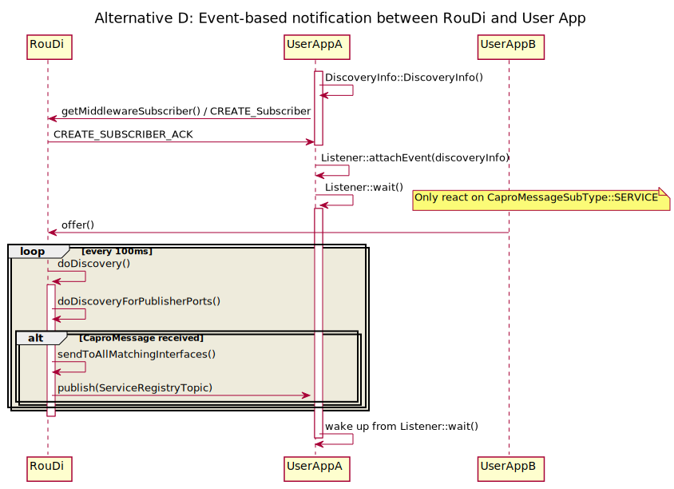

# Service Discovery

## Summary and problem description

Service discovery over IPC channel e.g. message queue or UNIX domain socket is not performant since larger data is
transferred, which can lead to transmission of several frames. If lots of services are discovered at high-frequency
e.g. at startup the IPC channel can become a bottleneck.

### Status quo in iceoryx v1.0 (Almond)

#### Runtime

* `iox::expected<InstanceContainer, FindServiceError> PoshRuntime::findService(capro::ServiceDescription)`
  * Sends message over IPC channel

#### RouDi

* `runtime::IpcMessage {ProcessManager,PortManager}::findService(capro::ServiceDescription)`
  * Called after RouDi has received a request from the runtime
  * Sends back answer to `PoshRuntime` over IPC channel

## Requirements

* The user interface shall have a poll and a push notification interface.
* Request/Response and Publish/Subscribe topics shall be discoverable and distinguishable
    by the user.
* It must be guaranteed that the user cannot compromise the service discovery
  * By acquiring memory chunks which are required for the service discovery communication
  * By sending false service discovery information on a user created service
* A C interface shall be available
* The memory overhead should be minimal to enable this feature in a wide range of
    environments
* The performance shall be optimised for a default use case where most services
    are created on startup and changes in the service discovery are minimal during
    runtime.
* It shall be possible that every application uses service discovery concurrently
    without compromising the system.

### Extended optional requirements for the future

* The discovery shall inform the user if a given topic is usable for them. E.g.
    provide information about
    * The history size
    * The communication strategy, blocking vs. non blocking.
    * Number of publishers
    * Access rights of the shared memory segment on which the topic is offered
    * Number of subscribers, are to much already subscribed
    * The type of memory segment used by the topic. Interesting when devices
        like GPUs come into play.
* Connect the service discovery via gateways so that a user can lookup
    * Services of a remote iceoryx instance connected via the dds gateway
    * Services of a different protocol like SomeIP or DDS
    * The user requires the ability to distinguish between local and remote
        iceoryx instance or protocol type

### Static discovery Design Draft

* Static discovery shall be supported
  * On startup a config file is read by RouDi which contains
    * All topics (publish/subscribe)
    * All services (request/response)
  * The shared memory management segment is preconfigured by RouDi and contains
      already all hard wired publisher-, subscriber-, server- and client-ports and 
      the application acquires those pre-created and pre-connected ports.
* Create abstract interface for `ServiceRegistry`
  * Add new class to `StaticServiceRegistry::StaticServiceRegistry(std::map<CaproIdString_t, instance_t> map)`
    * Notification-based callback is only called once and and the user gets the complete service registry
    * Polling with `FindService()` will always return the same result
  * Alternative would be a `finalize()` method after init phase

##### Alternative D: Discovery Class + Listener

Create a new publisher in RouDi which sends a `ServiceRegistryTopic`. This publisher would be used both to signal a
change in the service registry and to transmit the service discovery registry. The complete old service registry
(saved locally) would be compared to the new service registry in a new class, extending the public user API.

Pro:

* Simple and consistent user API for both event-based and sychronous requests
  * Filtering for `findService` could be done inside the new class
* No need for a change counter as ABA problem solved by POSH mechanisms
* Not just delta of service registry is transmitted, but complete service registry info
* Fast data transport
* Close to DDS mechanism
* Could replace `InterfacePort`s

Con:

* New publisher in RouDi needed
* Memory consumption is high through to traditional pub/sub

Note:

* To avoid any out of memory issues with custom user-configured mempools or access rights problems, the publisher shall
write into the `iceoryx_managment` segment (same applies for the introspection publishers)

##### Alternative E: Introduce new StatusPort/ConfigPort/BroadcastPort

Traditional publishers and subscribers are not optimised for sending data that does not change very often or never
(e.g. parameter, configurations or introspection data). In case the traditional publishers and subscribers are
re-used as `StatusPort`s like in alternative D the memory consumption is high and only needed rarely in certain
situations (like startup). For that reason a new class of ports called `StatusPort` shall be introduced. Internally
only two memory chunks shall be used similar to `iox::concurrent::TACO` using a ABA counter to check if the writer
has written while the reading was reading (Frankenstein object). The reader shall copy the `ServiceRegistryTopic`
to a local copy from shared memory. Only trivially copyable data shall be supported.
Client data shall not be accessed directly, but through a lambda.

Pro:

* `StatusPorts` can be used to communicate between two safety domains (e.g. ASIL-B and ASIL-D) as the subscriber would
only need read access and not write access
* Re-use the `StatusPort` for introspection 2.0, heartbeat/keepalive and to send static configurations
* Fast data transport by using shared memory
* Could replace `InterfacePort`s
* Not just delta of service registry is transmitted, but complete service registry info
* Simple and consistent user API for both event-based and sychronous requests
  * Filtering for `findService` could be done inside the new class

Con:

* New class, which needs RouDi infrastructure integration (e.g. requesting this port)
* Copy is necessary
* Starvation possible if the writer updates too often and the reader never finished its read (is a general lock-free
problem and should be taken care by good documentation)

## Open issues

