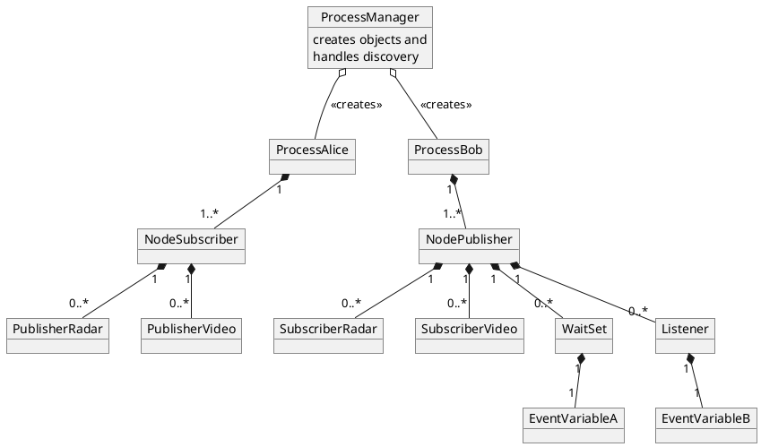

# Shared Memory Object Creation - Quo vadis ProcessManager?

## Summary and problem description

In iceoryx applications use a different means of communication to register with the central daemon RouDi and hereby gain access to the shared memory segments. Either a POSIX message queue or a UNIX domain socket can be used.

### Problems

* IPC channel communication is string/ASCII based
  * Therefore, `ProcessManager` uses strings to iterate over its process list
* Loosely coupled user-creatable application entities
  * `Process`, `Node`, `Publisher`, `Subscriber`, `ConditionVariable` can be created independent from each other
  * No hierarchical dependecy between entitites
  * RAII principle not followed, if `Process::~Process()` is called e.g. `Node` is not cleaned up
* Repetitive code duplications needed if new entities are added
* Inconsistency regarding creation and deletion of entities in shared memory
  * They are created via IPC channel (e.g. `CREATE_PUBLISHER`)
  * If an entitiy is destructed in the user application, `m_ToBeDestroyed = true`
  * RouDi acts as a garbage collector, checks this bool and cleans up resources

### In scope

* Which task shall the `ProcessManager` and `PortManager` have?
* How shall the data of the user-creatable entities be stored? `cxx::vector`, `cxx::list`?
* Clear responsibilty for entities and their ownership during lifetime
  * What are the pitfall for inter-process RAII?

### Out of scope

* IPC channel session protocol (#332)

## Terminology

| Name              | Description                                                                          |
| :---------------- | :----------------------------------------------------------------------------------- |
| `PoshRuntime`     | Singleton-like class which handles entitiy creation for user                         |
| `EntitiyFactory`  | Possible factory creating e.g. `Process`, `Node`, `Publisher`, etc.                  |
| `IpcMessageType`  | Enum containing all possible message kinds                                           |
| `ProcessManager`  | Delegates creation of user application entitites to `PortManager`                    |
| `PortManager`     | Creates and removes entities in shared memory via `PortPool`, does discovery         |
| `PortPool`        | Stores entities and provides acccess methods                                         |

## Design

`iox::runtime::PoshRuntime::initRuntime("foo")` shall create both a `Process` and `Node`. All other entities
live inside the `Node`. If wanted, other `Nodes` can be created by calling `createNode()`. The following object
diagram depicts an example.

### General object diagram



If a `Process` is destructed it shall automatically cause the deletion of all of its contained entities.

Merge `PortManager` and `ProcessManager` together into a `EnitityFactory`. Another name could be`UserObjectFactory`. `PortPool` shall stay as the interface to the shared memory data structures.

### Alternative 1

`PoshRuntime` only registers via IPC channel and uses a factory in shared memory to create the entities.

The `IpcMessageType` would look like:
```cpp
enum class IpcMessageType : int32_t
{
    BEGIN = -1,
    NOTYPE = 0,
    REG,
    REG_ACK,
    KEEPALIVE,
    MESSAGE_NOT_SUPPORTED,
}
```

On registriation a pointer to a `EnitityFactory` would be provided and the `PoshRuntime` would be able use it indepently. This class would need to be thread-safe.

```cpp
cxx::unique_ptr<PublisherPortUserType::MemberType_t>
PoshRuntime::getMiddlewarePublisher(const capro::ServiceDescription& service,
                                    const popo::PublisherOptions& publisherOptions = popo::PublisherOptions(),
                                    const PortConfigInfo& portConfigInfo = PortConfigInfo()) noexcept
{
    return m_entityFactory->createPublisher();
}
```

### Alternative 2

```
enum class IpcMessageType : int32_t
{
    BEGIN = -1,
    NOTYPE = 0,
    REG,
    REG_ACK,
    CREATE_PUBLISHER,
    DELETE_PUBLISHER,
    // [snip]
    KEEPALIVE,
    MESSAGE_NOT_SUPPORTED,
}
```

* `PoshRuntime` does registration and creation of entities via IPC channel and factory is soley accessed by RouDi. The IPC channel would transfer raw pointers which would be wrapped in `unique_ptr`'s by the `PoshRuntime`. In case of a graceful shutdown of an application the deleter function of the `cxx::unique_ptr` would cleanup the resources e.g. `Process`.

### Considerations

* Alternative 1 might result in `wait()` calls on two data structures (IPC channel, factory queue)
* Alternative 1 can lead to severe errors if (rogue/ badly written) user applications randomly write over the `EntitiyFactory` in shared memory by mistake
* Alternative 1's concurrent access on data structures of `EntitiyFactory` can lead to higher complexity (locking or lock-free mechanism required)
* Alternative 2 is likely to lead to a bottleneck on the IPC channel for a large system, where a lot of entities are dynamically created during runtime
* In case of hard crashes, RouDi has to act as a sort of garbage collector to clean up old resources for both alternative 1 and 2

### Solution

### Code example

## Open issues

* Which design alternative to choose?
* Find sane names for all new classes
