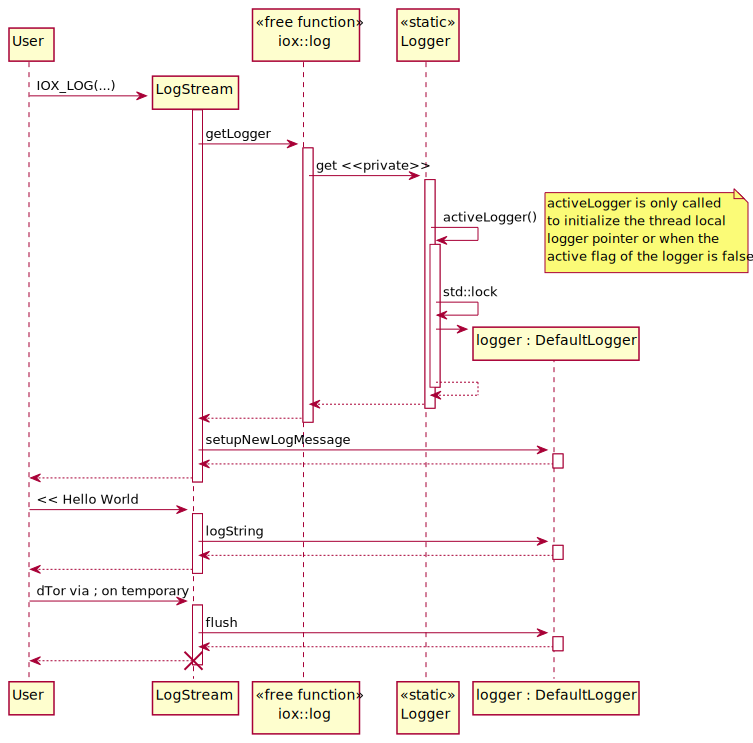
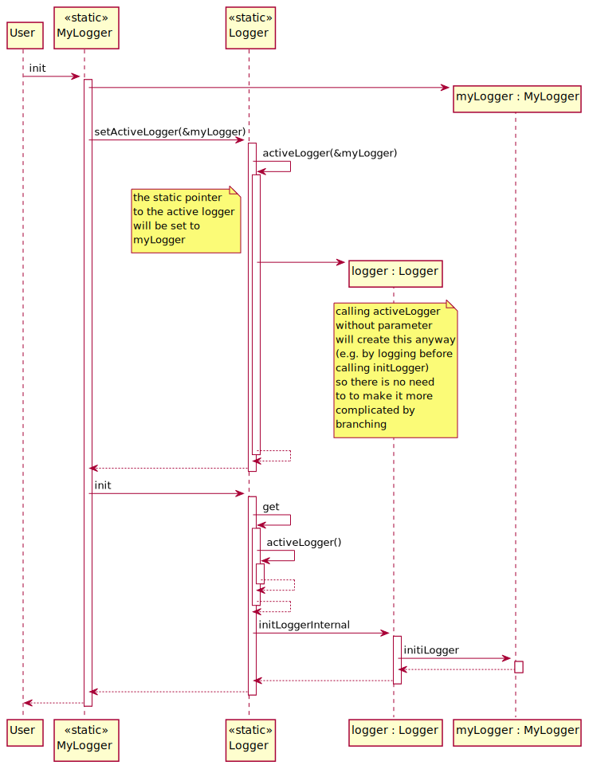
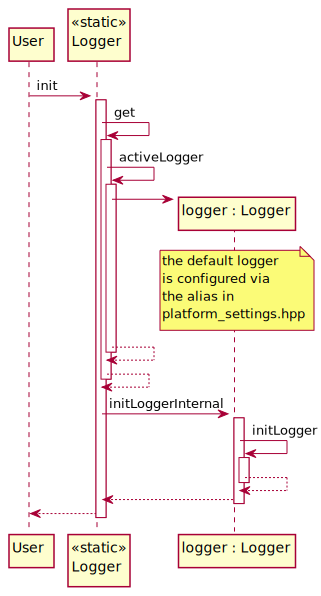
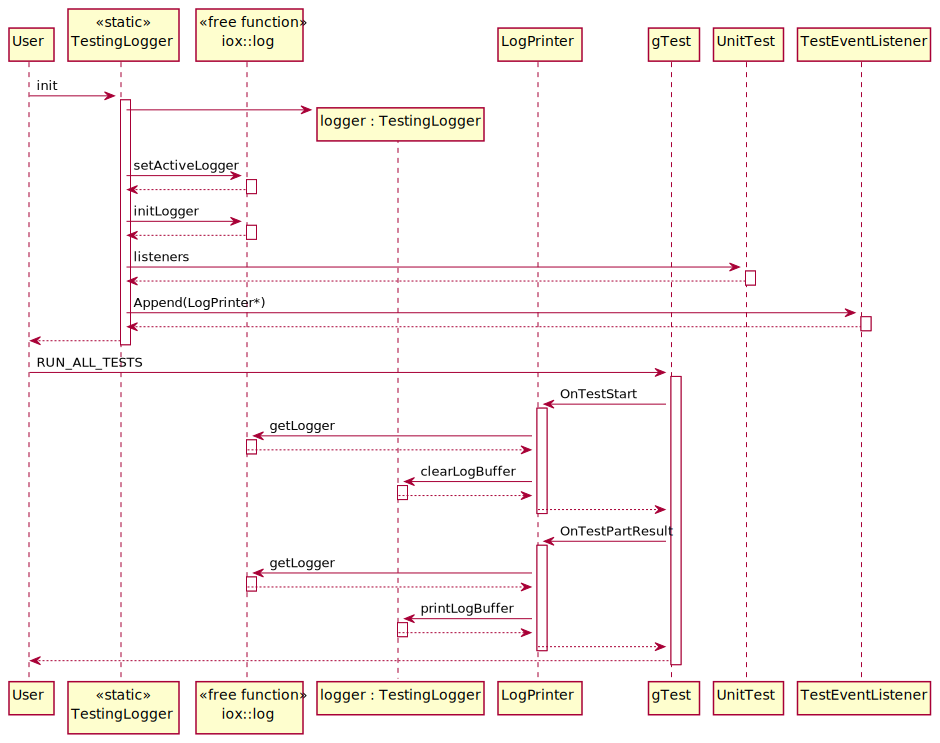

# Logging

## Summary and problem description

Logging is a crucial part of a framework since it informs the developer and
user of the framework about anomalies and helps with debugging by providing
contextual information.

### Requirements

When integrated into a separate framework, the log messages should be forwarded
in order to have a single logging infrastructure.

The logging should also be performant and not allocate memory. Ideally, it should
be possible to disable it at compile-time and let the compiler optimize it away.

It should also be possible to alter the behavior of the logging via environment
variables, e.g. the log level.

## Terminology

### Log levels and how to use them

| LogLevel | Usage |
|----------|-------|
| FATAL    | For fatal and non-recoverable errors which essentially lead to termination of the program. |
| ERROR    | For severe but recoverable errors. |
| WARN     | For cases when something unintentional happens which is not considered a severe error. |
| INFO     | Anything which could be relevant for the daily user. |
| DEBUG    | Anything that is helpful for debugging, i.e. the info log level for the fellow developer. |
| TRACE    | Anything that might be helpful for debugging in some cases but would be too verbose for debug log level. |

The log levels `FATAL`, `ERROR` and `WARN` should not be used independently but
in combination with the error handler and vice versa.

## Design

### Considerations

1. Similar to other iceoryx constructs, heap usage, exceptions and recursive
   calls are forbidden. This also means that `std::string` and
   `std::stringstream` cannot be used.

2. Since the logger shall be used by the `iceoryx_hoofs` itself, the base
   implementation can also not make use of functionality in e.g. `iox::cxx` or
   `iox::posix`

3. To have a minimal runtime overhead, string formatting shall only happen when
   the log level is above the output threshold. This lazy evaluation shall also
   apply to other potentially expensive operations like the execution of a
   function call.

4. Additionally, the minimal log level shall be configurable by a compile-time
   switch and everything below this log level should be compiled to no-ops. With
   this, developer can make excessive use of the most verbose log level and
   disable it by default. When debugging, this can be turned on and help to find
   the root of the problem.

5. There shall also be the possibility to alter the behavior of the logger via
   environment variables. This can be functionality like setting the log level or
   deciding whether the timestamps or file names shall be part of a log message.

6. Since iceoryx is often used as transport layer in a higher level framework, it
   shall be possible to replace the default logger at runtime and delegate the
   log messages to the logger of such a framework. To prevent misuse, this can
   only be done during the initialization phase. Afterwards an error message shall
   be logged in the new and old logger and the error handler shall be called with
   a moderate error level.

7. The default logger shall be replaceable via the platform abstraction in order
   to use the dedicated logger for log messages which are emitted before it could
   be replaced at runtime, e.g. from global objects before `main`.

8. Additionally, there shall be a compile-time option to forward all log messages
   independent of the log level threshold for cases where the logger framework
   does the filtering itself.

9. Logging with the default logger shall be non-blocking during runtime.

10. For tests, the default logger shall be replaced to suppress the log messages in
    passed tests but output them for failed tests. This keeps the noise low but
    still provides useful information when needed. Additionally, there shall be an
    environment variable to circumvent the suppression when desired.

### Solution

#### Class diagram


The logger can be customized at compile-time and at runtime. The former is done
by the `BaseLogger` template parameter and the latter by deriving from the logger.

#### Logging with LogStream



#### Logging macro with lazy evaluation

The `IOX_LOG` macro is intended for general use. It has two parameters. The first one
sets the log level and delegates `file`, `line` and `function` to the `IOX_LOG_INTERNAL`
macro. The latter can be used in places like a custom `ASSERT` macro which already
obtained the `file`, `line` and `function` parameter. The second parameter contains
the items to log and multiple items can be logged by using the '<<' operator.

The buildup of the log message is only done when the condition to log the message
is fulfilled. This is accomplished by a macro with an if-statement.

```cpp
#define LAZY(cond, expr) if (cond) { expr; }

LAZY(x == 42, expensiveFunctionCall());
```

In the example above `expensiveFunctionCall` is only executed if `cond` is `true`.
If `cond` is a compile time constant set to `false`, the whole statement is compiled
to a no-op and optimized away.

This is the log macro with lazy evaluation

```cpp
inline bool isLogLevelActive(LogLevel logLevel) noexcept
{
    return ((logLevel) <= MINIMAL_LOG_LEVEL)
           && (IGNORE_ACTIVE_LOG_LEVEL || ((logLevel) <= iox::log::Logger::getLogLevel()));
}

#define IOX_LOG_INTERNAL(file, line, function, level, msg_stream)               \
    if (iox::log::internal::isLogLevelActive(level))                            \
    {                                                                           \
        iox::log::LogStream(file, line, function, level).self() << msg_stream;  \
    }                                                                           \
    [] {} () // the empty lambda forces a semicolon on the caller side

#define IOX_LOG(level, msg_stream)                                              \
    IOX_LOG_INTERNAL(__FILE__, __LINE__, __FUNCTION__, iox::log::LogLevel::level, msg_stream)
```

With `MINIMAL_LOG_LEVEL` and `IGNORE_ACTIVE_LOG_LEVEL` being static `constexpr`
constants the compiler will optimize this either to
`if (false) { iox::log::LogStream(...) ... }` and finally completely away or
`if ((level) <= iox::log::Logger::getLogLevel()) { iox::log::LogStream(...) ... }`.
The minimal log level check is intended to fully optimize away a log statement
and the ignore active log level check to always forward the log message to the
logger, independent of the active log level.

The `IOX_LOG_INTERNAL` calls `self()` on the `LogStream` instance to create an lvalue
reference to the `LogStream` instance. This eases the implementation of logging
support for custom types since `IOX_LOG(INFO, myType);` would require to implement
an overload with a rvalue `LogStream` reference but `IOX_LOG(INFO, "#### " << myType);`
requires a lvalue reference.

#### Behavior before calling Logger::init

In order to have log messages before `Logger::init` is called, the default logger
is used with `LogLevel::INFO`. It is up to the implementation of the default
logger what to do with these messages. For iceoryx the default logger is the
`ConsoleLogger` (this can be changed via the platform abstraction) which will
print the log messages to the console.

Although, it is possible to use the logger without calling `Logger::init`, this is
not recommended. This behaviour is only intended to catch important log messages
from pre-main logger calls.

#### Replacing the logger at runtime

The default console logger can be replaced at runtime to a custom logger which
can be used to forward the log messages to a logger of another framework.

This is done by deriving from the base `Logger` class and implementing the pure
virtual `createLogMessageHeader` and `flush` methods. Finally, the derived logger
must be activated by calling the static `Logger::setActiveLogger` function and
passing the new logger as argument to the function. The logger must have a static
lifetime and should therefore be placed in the data segment.

The logger can only be set once and subsequent calls to `Logger::setActiveLogger`
will have no effect. Instead, an error message will be logged to both loggers to
notify both parties of the unsuccessful attempt to switch the active logger and
the application will continue to use the original logger for subsequent logs.

The call to `iox::log::Logger::init` will initialize the logger and needs to be
done after `Logger::setActiveLogger`.

See also the code example to [create a custom logger](#creating-a-custom-logger).



#### Replacing the default logger at compile-time

This is currently only partly implemented.

Customization will be done via the `iox/logger.hpp` file. This is currently in
`iceoryx_hoofs/reporting/include/iox/logger.hpp`. To enable the customization
it will be moved to `iceoryx_hoofs/customization/log/iceoryx_hoofs/log/logger.hpp`.
The path to `customization/log` can then be set via cmake argument or toolchain
file and by default will point the the implementation in `iceoryx_hoofs`.
This is similar to the `iceoryx_platform` customization.

The `iox/logger.hpp` header must specify the `Logger` and `TestingLoggerBase`
alias as well as defining the `IGNORE_ACTIVE_LOG_LEVEL` and `MINIMAL_LOG_LEVEL`
constexpr variables.

This is an example file
```cpp
namespace iox
{
namespace log
{
using Logger = internal::Logger<ConsoleLogger>;
using TestingLoggerBase = internal::Logger<ConsoleLogger>;

static constexpr bool IGNORE_ACTIVE_LOG_LEVEL{false};
static constexpr LogLevel MINIMAL_LOG_LEVEL{build::IOX_MINIMAL_LOG_LEVEL};
}
}
```

While the `Logger` alias could be a fully independent re-implementation of the
`internal::Logger<T>` interface, it is recommended to only implement the `BaseLogger`
and pass it as template parameter to `internal::Logger<T>`.

The `pbb::ConsoleLogger` is an example of such an implementation and can also be
a base for customization.

The `BaseLogger` part of the logger must fulfil the following interface

```cpp
public:
  static LogLevel getLogLevel();
  static void setLogLevel(LogLevel logLevel);
protected:
  virtual void initLogger(LogLevel logLevel);
  virtual void createLogMessageHeader(const char* file, const int line, const char* function, LogLevel logLevel);
  virtual void flush();
  LogBuffer getLogBuffer() const;
  void assumeFlushed();
  void LogString(const char* message);
  void logBool(const bool value);
  void logDec(const T value);  // with T being arithmetic types
  void logHex(const T value);  // with T being unsigned integers, floats or pointer
  void logOct(const T value);  // with T being unsigned integers
```

Tests should be silent and not flood the console with expected error messages.
`TestingLoggerBase` will be used as base class for the testing logger to suppress
the output for passed tests. This class must also be derived from `Logger` in
order to replace the logger at runtime.



#### Dedicated logger for testing

In order to have quiet tests, the logging output shall be suppressed for passed
tests and printed to the console for failed tests.

For this purpose a `TestingLogger` shall be supplied and initialized right after
`::testing::InitGoogleTest(&argc, argv)` and before `RUN_ALL_TESTS()`

This are the classes involved in the testing setup:


This is the sequence diagram of the setup of the testing logger:



#### Environment variables

The behavior of the logger can be altered via environment variables and the
`Logger::init` function. Calling this function without arguments, it will check
whether the environment variable `IOX_LOG_LEVEL` is set and use that value or
`LogLevel::INFO` if the environment variable is not set. To have a different
fallback log level, the `logLevelFromEnvOr` function can be used, e.g.

```cpp
iox::log::Logger::init(iox::log::logLevelFromEnvOr(iox::log::LogLevel::DEBUG));
```

If the logger shall not be altered via environment variables, `Logger::init` must
be called with the fitting log level.

For the `TestingLogger` there is an additional environment variable called
`IOX_TESTING_ALLOW_LOG`. This enables the printing of the log messages for all
tests instead of only for failed ones.

| Environment variable | Allowed values |
|--------------|-----------|
| IOX_LOG_LEVEL | off, fatal, error, warn, info, debug, trace |
| IOX_TESTING_ALLOW_LOG | on, off |

#### Thread local storage

The `Logger` base class is using thread local storage to provide a buffer for
each thread. In case thread local storage is not desired, the logger must be
re-implemented via the platform abstraction.

### Code example

#### Using the default console logger

```cpp
#include "iox/logging.hpp"

int main()
{
    iox::log::Logger::init(iox::log::logLevelFromEnvOr(iox::log::LogLevel::DEBUG));

    IOX_LOG(DEBUG, "Hello World");

    return 0;
}
```

#### Add logging support for custom types

```cpp
#include "iox/logging.hpp"
#include "iox/logstream.hpp"
#include <cstdint>

struct MyType
{
    uint16_t a {0};
    uint16_t b {0};
};

iox::log::LogStream& operator<<(iox::log::LogStream& stream, const MyType& m)
{
    stream << "MyType { a = " << m.a << "; b = " << m.b << " }";
    return stream;
}

int main()
{
    MyType m;
    IOX_LOG(INFO,  m);

    return 0;
}
```

#### Creating a custom logger

This is a simple custom logger which prints the log level as emoji and ignores
the file, line number and function name.

```cpp
#include "iox/logger.hpp"
#include "iox/logging.hpp"

class MyLogger : public iox::log::Logger
{
  public:
    static void init()
    {
        static MyLogger myLogger;
        iox::log::Logger::setActiveLogger(myLogger);
        iox::log::Logger::init(iox::log::logLevelFromEnvOr(iox::log::LogLevel::INFO));
    }

  private:
    void createLogMessageHeader(
        const char* file [[maybe_unused]],
        const int line [[maybe_unused]],
        const char* function [[maybe_unused]],
        iox::log::LogLevel logLevel) noexcept override
    {
        switch(logLevel) {
            case iox::log::LogLevel::FATAL:
                logString("💀: ");
                break;
            case iox::log::LogLevel::ERROR:
                logString("🙈: ");
                break;
            case iox::log::LogLevel::WARN:
                logString("🙀: ");
                break;
            case iox::log::LogLevel::INFO:
                logString("💘: ");
                break;
            case iox::log::LogLevel::DEBUG:
                logString("🐞: ");
                break;
            case iox::log::LogLevel::TRACE:
                logString("🐾: ");
                break;
            default:
                logString("🐔: ");
        }
    }

    void flush() noexcept override {
        puts(iox::log::Logger::getLogBuffer().buffer);
        iox::log::Logger::assumeFlushed();
    }
};

int main()
{
    MyLogger::init();

    IOX_LOG(FATAL, "Whoops ... look, over there is a dead seagull flying!");
    IOX_LOG(ERROR, "Oh no!");
    IOX_LOG(WARN, "It didn't happen!");
    IOX_LOG(INFO, "All glory to the hypnotoad!");
    IOX_LOG(DEBUG, "I didn't do it!");
    IOX_LOG(TRACE, "Row row row your boat!");

    return 0;
}
```

## Open issues

### Miscellaneous

- do we need to change the log level after `Logger::init`
- do we want a `IOX_LOG_IF(cond, level, msg_stream)` macro
- shall the `TestingLogger` register signals to catch `SIGTERM`, etc. and print the
  log messages when the signal is raised? It might be necessary to wait for the
  error handling refactoring before this can be done
- instead of having the `Logger::init()` static function with hidden default
  parameter this could be replaced by `Logger::init(LogLevel::WARN)`,
  `Logger::initFromEnvOr(LogLevel::WARN)` and a builder like
  `Logger::customize().logLevelFromEnvOr(LogLevel::WARN).init()`
- wrap `__FILE__`, `__LINE__` and `__FUNCTION__` into a `source_location` struct
  - where should this struct be placed
  - could also be used by `IOX_EXPECTS`, `IOX_ENSURES`
