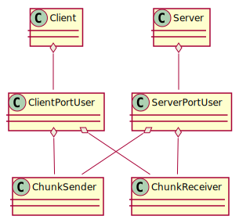
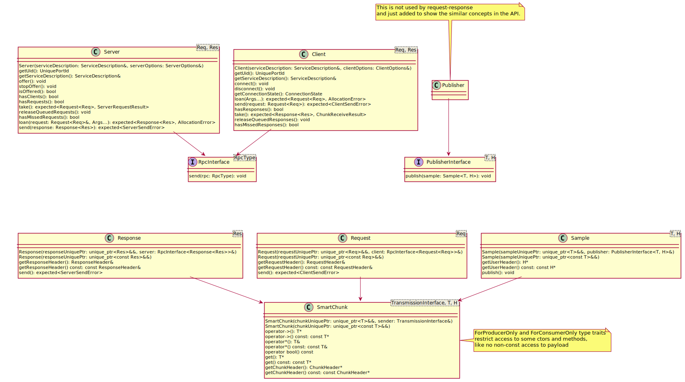
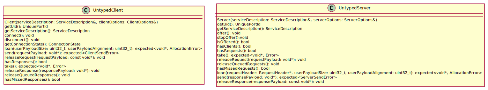
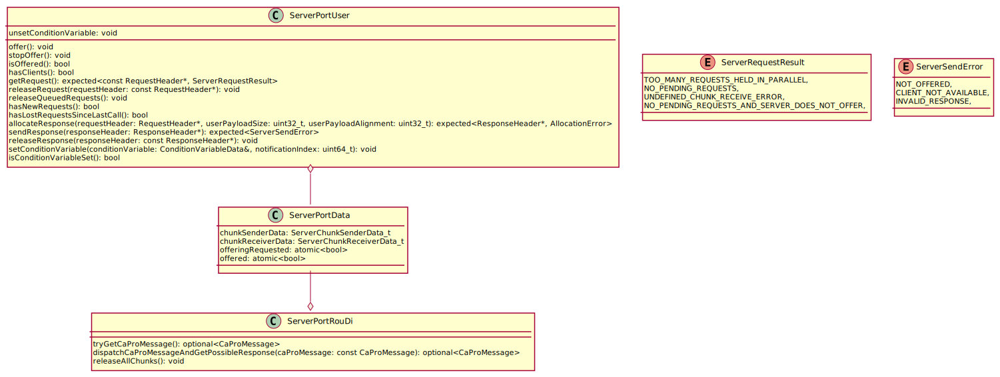
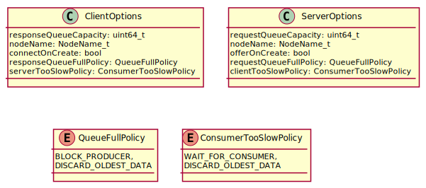
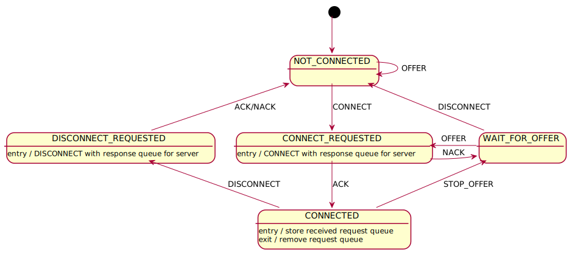
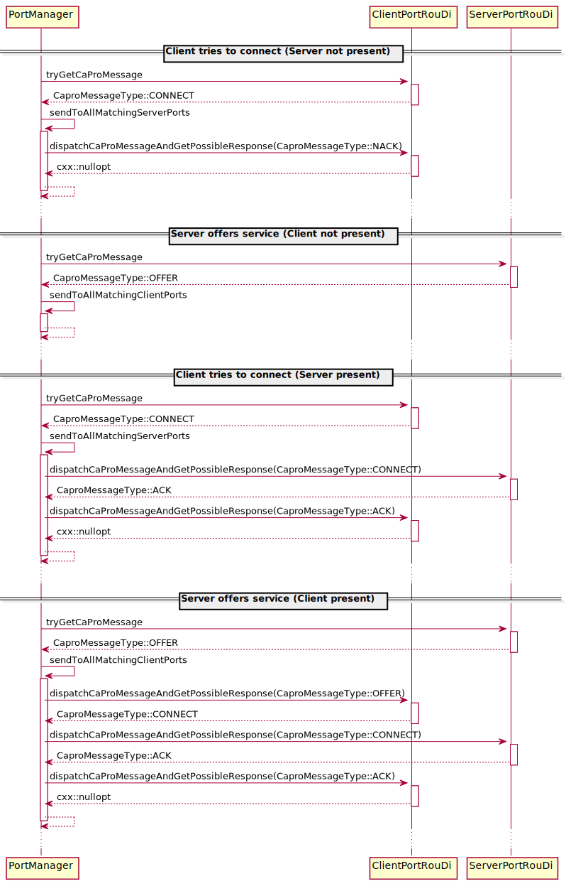

# Request/Response Communication

## Summary

Beside the publish-subscribe messaging pattern initially supported by iceoryx,
the request-response pattern is also widely used in the field where iceoryx is headed.
Since we aim for a good integration with ROS 2, this is also necessary to support its
`Service` communication method which is often used to control robots.

While publish-subscribe is a data distribution pattern which continuously delivers
updates on its data, request-response is a remote procedure call and task distribution pattern
which delivers data only on demand. This means there is one or several clients
requesting a server to perform a task.

In iceoryx, the client and server will be built on top of the same building blocks
we already use for publish-subscribe, like the `ChunkSender` and `ChunkReceiver`.

## Terminology

| Name              | Description                                              |
| :---------------- | :------------------------------------------------------- |
| Request-Response  | communication pattern which delivers data on demand      |
| Publish-Subscribe | communication pattern which continuously delivers updates on its data |
| RPC               | a remote procedure call to offload task to a server      |
| Client            | an entity invoking RPCs                                  |
| Server            | an entity processing RPCs                                |

## Design

### Considerations

Client and server shall be able to be used in combination with the `WaitSet` and `Listener`
to provide a means of event based communication instead of polling.

Like with publish-subscribe, the `ServiceDescription` will be used to connect clients with a corresponding server.

In order to support asynchronous requests, a sequence ID should be part of each request which will be copied to the corresponding response.

### Solution

This is an overview of the untyped `Client` and `Server` classes.



The `Client` and `Server` are reusing the `ChunkSender` and `ChunkReceiver` building blocks. The `Client` uses a `ChunkSender` to send requests and a `ChunkReceiver` to get the responses while the `Server` uses a `ChunkReceiver` to get the requests and a `ChunkSender` to send the responses.

#### Typed API



Since the `Response` is tied to a specific `Request`, the `loan` method takes a `Request` to populate the `Response` with the correct settings.
Alternatively, a `Request` could have a `createResponse` method which returns a `Response` with the correct settings.

#### Untyped API



Similar to the the typed API, `loan` takes a pointer to a `RequestHeader` to populate the `ResponseHeader` with the correct settings.

#### Client Port


The `ClientPortData` is located in the shared memory and contains only the data but no methods to access them.
`ClientPortUser` is the class providing the methods for the user access and `ClientPortRouDi` provides the
interface RouDi needs to connect the client to the server and to cleanup the port resources.

#### Server Port



Similar to the Client Port, the Server Port has `ServerPortData` which is located in the shared memory and contains only the data but no methods to access them.
`ServerPortUser` is the class providing the methods for the user access and `ServerPortRouDi` provides the
interface RouDi needs to connect the client to the server once the server offers its service and to cleanup the port resources.

It must be ensured that only one server with a given `ServiceDescription` can run at a time.

#### Request/Response Header


Since request and response need to encode different meta-information, we also need different headers for the messages.
The common data is aggregated in `RpcBaseHeader` which contains a `iox::UniqueId` to the `ClientChunkQueueData_t` and a sequence ID.
The `iox::UniqueId` is used to identify the queue which receives the response and used as identifier for `ChunkDistributor::deliverToQueue`.
This method will iterate over all stored queues and matches the `ChunkQueueData::m_uniqueIdOfOwner`.
As optimization, the `lastKnownQueueIndex` will be used to do a fast lookup and downgrades to a full lookup if the queue IDs don't match.
```cpp
class ChunkDistributor {
    ...
    iox::expected<Error> deliverToQueue(iox::UniqueId uniqueQueueId, uint32_t lastKnownQueueIndex, mepoo::SharedChunk chunk);
    ...
};
```

The sequence ID is used to match a response to a specific request if multiple requests are invoke asynchronously.
Depending on the client and server options, a request might be dropped or a server could have a worker pool
which results in sending the responses in a different order than the request were received.
The sequence ID must be set by the user and also checked by the user on response.

#### Client/Server Options



The client and server options can be used to control certain aspects of the clients and servers.
Beside setting the capacity of the queues and defining whether a client should be connected and a server offering on creation,
the behaviour for a slow client and server can be defined.
A client can ask a server to block if its response queue is full.
The server will obey if the corresponding `clientTooSlowPolicy` is set to `ConsumerTooSlowPolicy::WAIT_FOR_CONSUMER`.
If the options don't match, the client will not be connected to the server, similar to the behavior of publisher and subscriber.

#### Client Service Discovery

The client is guided by the following state machine.



Similar to the subscriber state machine, the client passes it's response queue with the `CONNECT` CaPro message to the server.
The server will pass its request queue with the `ACK` CaPro message to the client.

Following is a sequence diagram which shows all this cases



## Open issues

- integration into port introspection
- integration into a gateway, e.g. the DDS gateway
