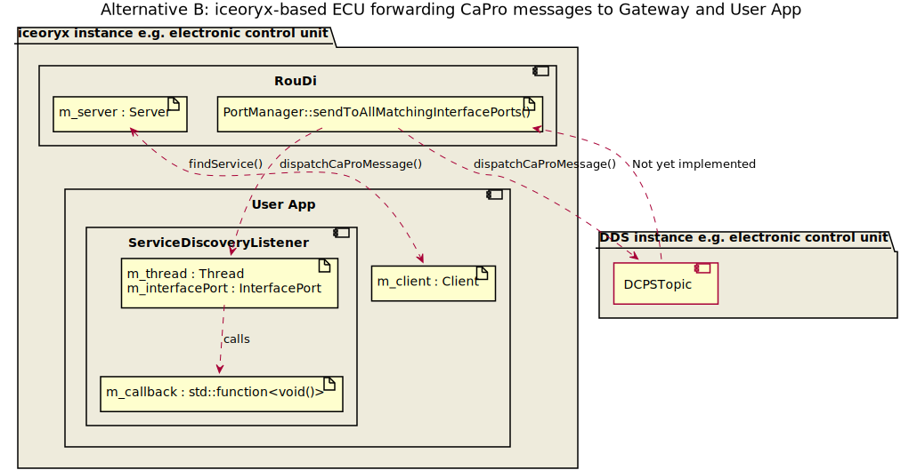
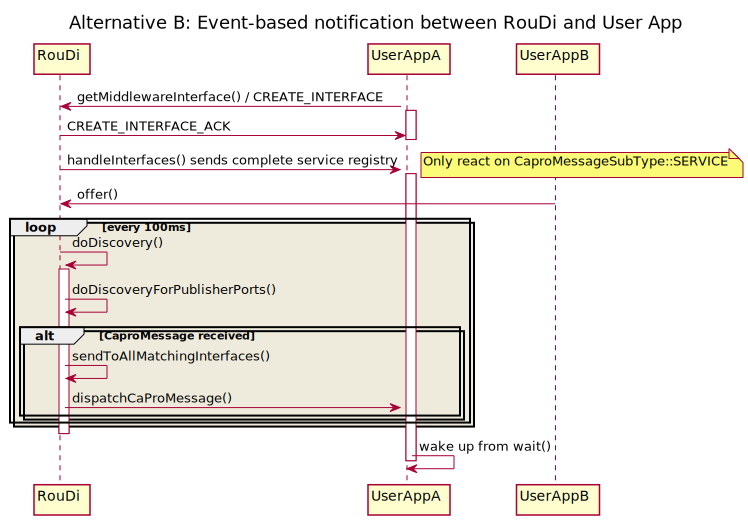

# Service Discovery

## Summary and problem description

Service discovery over IPC channel e.g. message queue or UNIX domain socket is not performant since larger data is
transferred, which can lead to transmission of several frames. If lots of services are discovered at high-frequency
e.g. at startup the IPC channel can become a bottleneck. Furthermore, in a safety environment the IPC channel should
just be used for the earliest communication during startup and not for the creation of objects inside the shared memory
(see [this issue](https://github.com/eclipse-iceoryx/iceoryx/issues/611)).

### Status quo in iceoryx Almond

#### Runtime

* `cxx::expected<InstanceContainer, FindServiceError> PoshRuntime::findService(capro::ServiceDescription)`
  * Sends message over IPC channel

#### RouDi

* `runtime::IpcMessage {ProcessManager,PortManager}::findService(capro::ServiceDescription)`
  * Called after RouDi has received a request from the runtime
  * Sends back answer to `PoshRuntime` over IPC channel

## Terminology

## Requirements

* Polling and event notification approach shall both be possible for service discovery

### Considerations and use-cases

#### AUTOSAR Adaptive

* findService() call as implemented in Almond v1.0
* ara::com service discovery callbacks

1. `StartFindService(std::function<void(ServiceContainer<T>,ServiceHandle)>, InstanceId)`: Register callback, std::function interface
1. `StopFindService(std::function<void(ServiceContainer<T>,ServiceHandle)>)`: Unregister callback
1. `FindService(InstanceId)`: one-shot, polling, synchronous

#### SOME/IP-SD

* Similar to AUTOSAR Adaptive

#### Cyclone DDS and ROS 2

* Cyclone DDS calls this feature [topic discovery](https://github.com/eclipse-cyclonedds/cyclonedds/blob/master/docs/dev/topic_discovery.md). See also the [feature request](https://github.com/eclipse-cyclonedds/cyclonedds/issues/42).

* Based on SEDP (simple endpoint discovery protocol)
* `dds_ktopic`
  * stores pointer to `ddsi_topic_definition`
* Has built-in DCPSTopic topic and contains
  * Topic name
  * Type name
  * Topic key
  * QoS settings
* `dds_find_topic_locally` w/o SEDP
* `dds_find_topic_globally` with SEDP

#### Static discovery

* Static discovery shall be supported
  * Having RouDi read in a config file, which has
    * All the topics listed
    * Wiring pub/sub information
  * Static shared memory with static number of pub/subs inside
  * During init phase pub/sub are connected
* Create abstract interface for `ServiceRegistry`
  * Add new class to `StaticServiceRegistry::StaticServiceRegistry(std::map<CaproIdString_t, instance_t> map)`
    * Notification-based callback is only called once and and user gets the complete service registry
    * Polling with `FindService()` will always return the same result
  * Alternative would be a `finalize()` method after init phase

#### Sychronous, one-shot RPC (Polling)

##### Alternative A: IPC channel usage

Stick with IPC channel

Pro:

* No code changes needed
* More memory efficient
* No managment overhead on iceoryx-side

Con:

* No userspace solution
  * IPC channel uses OS functions during runtime (switch between kernel and user space)
* Upper frame limit may lead to segregation into several frames

##### Alternative B: Request/ response feature usage

* Re-use [request/ response feature](https://github.com/eclipse-iceoryx/iceoryx/issues/27)

Pro:

* Re-use building blocks to avoid code duplication
* [Dogfooding](https://en.wikipedia.org/wiki/Eating_your_own_dog_food) your own features makes you aware of
potential issues
* Fast due to shared memory

Con:

* Shared memory approach might have overhead compared to a simple RPC call

#### Event-based notification

##### Alternative A: Shared memory + IPC channel

* Send ID's over IPC channel and read ABA-counter/ServiceDiscoveryChangeCounter from shared memory
* Data transfer over shared memory
  * Basically putting Service Registry to shared memory so everyone can access it (read-only)

Pro:

* Fast data transfer
* Could replace `InterfacePort`s

Contra:

* Bespoken solution more complex than todays approach (thread-safety required, lock-free mechanism needed)
* In a safety environment the IPC channel communication shall only be used for startup
* New thread needs to be maintained by user

##### Alternative B: Built-in topic based on `InterfacePort`'s

* Built-in topic approach based on `InterfacePort`'s
  * Sniff and intercept `CaproMessage`





Pro:

* Close to DDS mechanism
* `InterfacePort` already available
* Synergies with gateway mechanisms
* Gateways can benefit from event notification mechanism
  * No need for a polling-loop anymore

Con:

* Bookkeeping at user-side, just delta of service registry is transferred
* What will RouDi do if he runs out of memory?
  * Dimensioning according to max values is not optimal (MAX_INTERFACE_CAPRO_FIFO_SIZE)
  * Presumably lots of memory needed, e.g. during startup phase when lots of apps will do discovery
  * A safety-certified middleware based on iceoryx would not use the dynamic discovery feature

Remark:

* Extend `dispatchCaproMessage()` with condition variable and notification mechanism

##### Alternative C: Custom thread

* Implement a custom thread in `PoshRuntime`, which polls for specific discovery information using request/response

Pro:

* More flexible, e.g. thread can be used for other functionality in future
* Re-use req/resp building blocks

Con:

* Not needed by all users per default
* Polling leads to overhead

##### Alternative D: Discovery Class + Listener

Create a new publisher in RouDi which sends a `ServiceRegistryTopic`. This publisher would be used both to signal a
change in the service registry and to transmit the service discovery registry. The complete old service registry
(saved locally) would be compared to the new service registry in a new class, extending the public user API.


Pro:

* Simple and consistent user API for both event-based and sychronous requests
  * Filtering for `findService` could be done inside the new class
* No need for a change counter as ABA problem solved by POSH mechanisms
* Not just delta of service registry is transmitted, but complete service registry info
* Fast data transport
* Close to DDS mechanism
* Could replace `InterfacePort`s

Con:

* New publisher in RouDi needed
* Memory consumption is high through to traditional pub/sub

Note:

* To avoid any out of memory issues with custom user-configured mempools or access rights problems, the publisher shall
write into the `iceoryx_managment` segment (same applies for the introspection publishers)

##### Alternative E: Introduce new StatusPort/ConfigPort/BroadcastPort

Traditional publishers and subscribers are not optimised for sending data that does not change very often or never
(e.g. parameter, configurations or introspection data). In case the traditional publishers and subscribers are
re-used as `StatusPort`s like in alternative D the memory consumption is high and only needed rarely in certain
situations (like startup). For that reason a new class of ports called `StatusPort` shall be introduced. Internally
only two memory chunks shall be used similar to `iox::concurrent::TACO` using a ABA counter to check if the writer
has written while the reading was reading (Frankenstein object). The reader shall copy the `ServiceRegistryTopic`
to a local copy from shared memory. Only trivially copyable data shall be supported.
Client data shall not be accessed directly, but through a lambda.

Pro:

* `StatusPorts` can be used to communicate between two safety domains (e.g. ASIL-B and ASIL-D) as the subscriber would
only need read access and not write access
* Re-use the `StatusPort` for introspection 2.0, heartbeat/keepalive and to send static configurations
* Fast data transport by using shared memory
* Could replace `InterfacePort`s
* Not just delta of service registry is transmitted, but complete service registry info
* Simple and consistent user API for both event-based and sychronous requests
  * Filtering for `findService` could be done inside the new class

Con:

* New class, which needs RouDi infrastructure integration (e.g. requesting this port)
* Copy is necessary
* Starvation possible if the writer updates too often and the reader never finished its read (is a general lock-free
problem and should be taken care by good documentation)

### Decision

The **event-based notification alternative E** fulfills both requirements for a asychronous, one shot-polling approach as
well as the event-based one. It can replace the `InterfacePort`s, which broadens the usage e.g. for gateways or even
introspection 2.0. Furthermore, alternative E adds a new building blocks that can be used to communicate between two
different safety levels (e.g. ASIL-B & ASIL-D) while ensuring freedom from interference. The one-shot RPC call does
not lead to a shared memory transmission compared to the alternative B (request/response feature usage) as the
complete service registry is stored locally.

### Code example

#### Event-based notification: Alternative B

```cpp
auto& runtime = PoshRuntime::initRuntime("myApp");
auto* interfacePortData = runtime.getMiddlewareInterface(capro::Interfaces::INTERNAL);

InterfacePort caproSubscriber(interfacePortData);
Listener myListener;

void onDiscoveryUpdateCallback(InterfacePort* subscriber)
{
    subscriber->tryGetCaProMessage().and_then([](auto& caproMessage){
        // Has any service that is relevant for me changed?
        if(caproMessage.m_serviceDescription == myRelevantServiceDescription && someOtherCondition())
        {
            // call user-defined callback
        }
    });
}

myListener.attachEvent(caproSubscriber, DATA_RECEIVED, createNotificationCallback(onDiscoveryUpdateCallback));
```

#### Event-based notification: Alternative D

```cpp
class ServiceDiscovery
{
  public:

    // Move all service-related methods from PoshRuntime to this class
    ServiceContainer
    PoshRuntime::findService((const cxx::optional<capro::IdString_t>& service,
                              const cxx::optional<capro::IdString_t>& instance,
                              const cxx::optional<capro::IdString_t>& event) noexcept
    {
        m_subscriber.take().and_then([&](auto& serviceRegistrySample) {
            m_lastServiceRegistry = *serviceRegistrySample;
        });

        m_lastServiceRegistry.find(tempSearchResult, service, instance, event);

        ServiceContainer searchResult;
        for (auto& service : tempSearchResult)
        {
            searchResult.push_back(service.serviceDescription);
        }

        return searchResult;
    }

  private:
    void enableEvent(popo::TriggerHandle&& triggerHandle, const ServiceDiscoveryEvent event) noexcept;
    void disableEvent(const ServiceDiscoveryEvent event) noexcept;
    void invalidateTrigger(const uint64_t uniqueTriggerId);
    /// @todo #1098 This is not needed but currently required by the WaitSet
    iox::popo::WaitSetIsConditionSatisfiedCallback
    getCallbackForIsStateConditionSatisfied(const popo::SubscriberState state);
    Subscriber<ServiceRegistryTopic> m_subscriber{"ServiceDiscovery", "GlobalInstance", "ServiceRegistryTopic"};
    ServiceRegistryTopic m_lastServiceRegistry;
}

// Class should be attachable to Listener
iox::popo::ServiceDiscovery serviceDiscovery;
myListener.attachEvent(serviceDiscovery, DATA_RECEIVED, createNotificationCallback(userDefinedCallback));
```

#### Event-based notification: Alternative E

```cpp
// StatusPort implementation
StatusPortHeader {
    using uint64_t INVALID {0};
    using uint64_t UPDATING {-1};
    std::atomic<uint64_t> generation{INVALID};
}
template <typename T>
using StatusPortData = Sample<T, StatusPortHeader>; // pretty neat, eh? We use a chunk to store the StatusPortData -> this means the number of ports and data sizes can be configured by the user without recompiling RouDi; could potentially also be done for the other ports

template <typename T>
StatusPortWriter {
  public:
    void write(cxx::function_ref<void(T&)> f);
  private:
    StatusPortData<T> data; // potentially also just a `ChunkHeader*`
};

template <typename T>
StatusPortReader {
  public:
    void read(cxx::function_ref<void(const T&)> f);
  private:
    StatusPortData<T> data;
};

// User facing API
class ServiceDiscovery
{
  public:

    // Move all service-related methods from PoshRuntime to this class
    cxx::expected<InstanceContainer, FindServiceError>
    PoshRuntime::findService(const capro::ServiceDescription& serviceDescription) noexcept
    {
        // Update local service registry
        get();

        return filterFor(serviceDescription);
    }

    /// @todo Only implemenet if needed to replace the InterfacePort's
    ServiceRegistryTopic get() noexcept
    {
        m_statusPortReader.read([&](auto& ServiceRegistryTopic){
            // Update our local copy of the service registry
            m_lastServiceRegistry = ServiceRegistryTopic;
        });
        return m_lastServiceRegistry;
    }

    ServiceRegistryTopic getDelta() noexcept
    {
        auto old = m_lastServiceRegistry;
        get();
        return old - m_lastServiceRegistry;
    }

    ServiceRegistryTopic getDelta(const capro::ServiceDescription& serviceDescription) noexcept;

   filterFor(const capro::ServiceDescription& serviceDescription) noexcept;
  private:
    void enableEvent(popo::TriggerHandle&& triggerHandle, const ServiceDiscoveryEvent event) noexcept;
    void disableEvent(const ServiceDiscoveryEvent event) noexcept;
    void invalidateTrigger(const uint64_t uniqueTriggerId);
    /// @todo #1098 This is not needed but currently required by the WaitSet
    iox::popo::WaitSetIsConditionSatisfiedCallback
    getCallbackForIsStateConditionSatisfied(const popo::SubscriberState state);
    StatusPortReader<ServiceRegistryTopic> m_statusPortReader;
    ServiceRegistryTopic m_lastServiceRegistry;
}

// Class should be attachable to Listener
iox::popo::ServiceDiscovery serviceDiscovery;
myListener.attachEvent(serviceDiscovery, DATA_RECEIVED, createNotificationCallback(userDefinedCallback));
```

#### Sychronous, one-shot RPC (Polling): Alternative B

```cpp
// Binding code
auto& runtime = PoshRuntime::initRuntime("myApp");

runtime.findService({"Radar", "FrontLeft", "Objects"}).and_then([&](auto& container){
    // search the container
});


// Runtime implementation
cxx::expected<InstanceContainer, FindServiceError>
PoshRuntime::findService(const capro::ServiceDescription& serviceDescription) noexcept
{
    // Needs to be sychronous call, use request response feature here
    auto findServiceRequest = m_client.loanRequest();
    m_client.sendRequest(findServiceRequest, serviceDescription);

    m_client.takeResponse().and_then([&](){
        // fill the instance container
    });
    return instanceContainer;
}
```

## Open issues

* [x] What to do with `getServiceRegistryChangeCounter()` remove? Depends could be useful as ABA counter
* [x] How does the ara::com service discovery API look like?
* [x] How does the DDS service discovery API look like?
* [x] How does the SOME/IP-SD service discovery API look like?
* [x] What does a `ros topic list` do in rmw_iceoryx?
* [ ] Filter for `ServiceDescription::EventString` needed by AUTOSAR? Not supported by `ServiceRegistry::find()` as of today
* [ ] Decision on mapping table between iceory and DDS (see [Overview](../website/getting-started/overview.md))
  * [ ] Current mapping table between iceoryx and DDS does not work with service discovery
