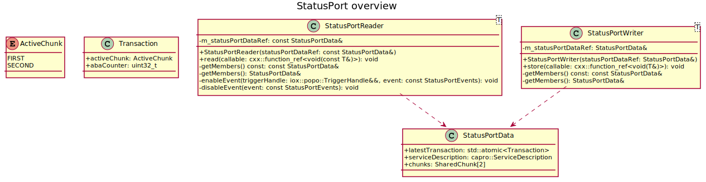

# StatusPort

## Summary and requirements

The `StatusPort` is an alternative to the publish subscriber communication in `iceoryx_posh`.

The `StatusPort` targets the use-cases with the following properties:

* Data is transferred once or is rarely updated
* There are many readers which are interested in the data
    * 1:n communication aka broadcast
* Data can be persistent
    * The lifetime of the transferred data is bound to the lifetime of `StatusPortData`
* `StatusPort` could potentially be used to communicate between different ASIL
domains as it shall only need read access to all shared memory segments on the
reader side

Potential applications are:

* Introspection topics
* Service discovery
* Broadcasting configurations or parameters

### Remarks

`StatusPort{Writer,Reader}` won't be part of the user API in the first version and will be
only used internally. However, they might become user API for freedom-from-interference separation
at a later point in time.

## Design

### Terminology

* World view/ latest transaction: Atomic state of the world, which is changed by a write operation
* Transaction: A change of the world view
* Current transaction: Transaction in local scope, read in the beginning of each operation
* Chunk: Untyped piece of memory located in the shared memory payload segment
* Read position: The chunk, which was used the last time to write data and is the one
which is read from
* Write position: The chunk which is used in a store operation, not currently being used by
the `StatusPortReader`s

### Contract & constraints

* Algorithm shall be lock-free
    * Data exchanged needs to be trivially-copyable
* Event notification of newly received data shall be possible
    * `StatusPortReader` to be attachable to `Listener` and `WaitSet`
* Readers don't access the data directly but via a lambda
    * Preventing torn reads, since the `StatusPortReader` detects if the data
    changed during `read()` operation and re-executes the lambda
* Storing a chunk cannot fail
* Reading a chunk cannot fail
    * If no data was sent yet, `callable` is not called
    * If data was updated in-between read, re-call `callable`
* Reader only needs write access to the data structure and no read access
* Writing and Reading will be tried indefinitely till possible, hence starvation
is possible
* `StatusPortData` is created in the shared memory segment if either a `StatusPortWriter`
or `StatusPortReader` is created
    * Two chunks in the shared memory payload segment are bound to the lifetime
    of the `StatusPortData` (either via `StatusPortData` c'tor or
    `StatusPort{Writer,Reader}` c'tor)

### Discarded ideas & design alternatives

#### Atomic pointer

The pointer to the currently active chunk could also be stored in an `std::atomic`.

```cpp
std::atomic<T*> activeChunk{nullptr}
```

However, it would need the full 64-bit and which is not needed when managing
just two chunks. Hence an `abaCounter` would need to be stored in a separate
`std::atomic` variable.

#### Omit `ServiceDescription` and discovery

Methods like `offer()` or `stopOffer()` are not needed to keep things simple.
However, omitting the `ServiceDescription` completely is not possible as it is
needed to associate the right `StatusPortData` in shared memory with the correct
writer or reader object on the stack. The `StatusPort` shall follow the
service-based design.

#### `atomic<T>::exchange` in `StatusPortReader::read()`

A [CAS](https://en.wikipedia.org/wiki/Compare-and-swap) operation is not possible
because CAS needs write access and a `StatusPortReader` shall not be allowed to
write data into shared memory.

#### Differentiate between Writer/Reader between RouDi/User?

To be consistent with the previously available publisher and subscribers one
could argue to follow the same naming. However, the `StatusPort` might be used to
communicate between ASIL domains in future and hence become user API. As a result
the naming shall stay Writer/Reader.

#### Can part of the previous port infrastructure be re-used?

Potential candidates:

1. `BasePort`
   1. The previously available publisher and subscribers follow a much more complex
   communication pattern. Hence, most of the data in `BasePort` is irrelevant and
   `StatusPortData` shall stay separate.
1. `popo::Sample`
   1. Due to the fact that data is accessed solely via `callable`'s there is no
   benefit in using the non-owning `popo::Sample` view.

### Solution

#### Class structure

Depicted below is the class diagram.



The `StatusPortWriter` is a template where `T` is the transferred data type.
It has a constructor which takes a pointer to the `StatusPortData`
object in the shared memory management segment. The pointer is acquired in the
same manner as previous publishers and subscribers via RouDi's unix domain
socket. The only difference is that one `StatusPortData` object is shared between
`StatusPortReader` and `StatusPortWriter`. `store()` takes a `function_ref` to
be able to manipulate the type in-place in shared memory.
`StatusPortReader` is a template as well and has the same constructor. The first
and single argument of`read()` is a `function_ref`, which is executed as long as
the `read()` was unsuccessful. Furthermore, the `StatusPortReader` has the methods
necessary to be attachable to a `popo::Listener` (e.g. `{enable,disable}Event`).

`StatusPortData` stores the latest atomic `Transaction` as well as two pointers
to `SharedChunk`s in the shared memory payload segment. The lifetime of the two
chunks is bound to the lifetime of the `StatusPortData` object. To be able to to
associate the correct readers and writers a `ServiceDescription` is used.

#### Frankenstein object corner cases

How can we ensure in `StatusPortWriter::store()` that there is no `StatusPortReader`
reading the chunk to which we want to write to? This could be for example a slow
`StatusPortReader`. Is a reference counter needed? No, this is not the case. Instead
the `StatusPortReader` checks if his view of on the world (aka the two chunks)
has changed in-between.

To illustrate this, let's assume that that there is one `StatusPortWriter` and one
`StatusPortReader` in this scenario. Further assume that the type transferred via
the `StatusPort` is

```cpp
T = cxx::string<36>
```

The following samples are transmitted by the `StatusPortWriter`

1. "Time And Relative Dimension In Space"
2. "Twin Ion Engines Fighter"
3. "USS Enterprise"

After the second transaction the `StatusPortReader` see's the latest transaction
below and starts reading the `chunk[1]` aka `SECOND`.

```text
Latest transaction in shared memory managment segment
+----------------------------------+
|       ActiveChunk::SECOND        |
|       abaCounter: 1              |
+----------------------------------+
```

Now the the `StatusPortWriter` starts writing concurrently the third sample and
overtakes the slower `StatusPortReader`.
Due the latest transaction depicted below, `writePosition` is calculated to
`chunks[1]` aka `SECOND`. Below you can find the location `^` at which the writer
is currently writing and the reader is reading. As a result the strings are mixed
up at this very moment in time, a so called Frankenstein object. While in this
case, the reader might still read uncorrupted data if he finished before the
writer, one can easily imagine that this can lead to very subtile, nasty bugs.
To avoid this problem the `StatusPortReader` compares the initial transaction
with the latest transaction and  re-calls the callable as long as they are not
the same.

```text
Shared memory payload segment
+----------------------------------------------------+
|        SharedChunk chunks[2]                       |
|        +----------------------------------------+  |
| FIRST  | "Twin Ion Engines Fighter"             |  |
|        +----------------------------------------+  |
| SECOND | "USS Enterprlative Dimension In Space" |  |
|        +----------------------------------------+  |
|                      ^                 ^           |
|                      Writer            Slow reader |
+----------------------------------------------------+

Latest transaction in shared memory managment segment
+----------------------------------+
|       ActiveChunk::FIRST         |
|       abaCounter: 2              |
+----------------------------------+
```

> ***
> Special care has to be taken, when writing the `callable`!
> ***
>
> It must be ensured that the `callable` does not crash or ends up in an endless
> loop, when working on the data

The memory order ``std::memory_order_release` and `std::memory_order_acquire`
ensure that the operations below the `load()` "happened-before" and the memory of
`chunks[]` is synchronized.

```text
// Write data via callable
callable(*(m_statusPortDataPtr->chunks[currentWritePosition]));
        \         /
         \       /
          \     /
           \   /
            \ /
    latestTransaction.store(newTransaction,   ----------+
       std::memory_order_release)                       |
                                                        +--------->   latestTransaction.load(std::memory_order_acquire)
                                                                                / \
                                                                               /   \
                                                                              /     \
                                                                             /       \
                                                                            /         \
                                                        // Read sychronized data via callable
                                                        callable(*(m_statusPortDataPtr->chunks[currentReadPosition].data));
```

### Code example

```cpp
// Copyright (c) 2022 by Apex.AI Inc. All rights reserved.
//
// Licensed under the Apache License, Version 2.0 (the "License");
// you may not use this file except in compliance with the License.
// You may obtain a copy of the License at
//
//     http://www.apache.org/licenses/LICENSE-2.0
//
// Unless required by applicable law or agreed to in writing, software
// distributed under the License is distributed on an "AS IS" BASIS,
// WITHOUT WARRANTIES OR CONDITIONS OF ANY KIND, either express or implied.
// See the License for the specific language governing permissions and
// limitations under the License.
//
// SPDX-License-Identifier: Apache-2.0

#ifndef IOX_POSH_POPO_STATUS_PORT_HPP
#define IOX_POSH_POPO_STATUS_PORT_HPP

#include "iceoryx_hoofs/cxx/function_ref.hpp"
#include "iceoryx_hoofs/cxx/helplets.hpp"
#include "iceoryx_hoofs/cxx/optional.hpp"
#include "iceoryx_hoofs/cxx/type_traits.hpp"
#include "iceoryx_posh/capro/service_description.hpp"

#include <atomic>
#include <cstring>

namespace iox
{
namespace popo
{
/// @todo #982 Create common .hpp for ActiveChunk and Transaction
enum class ActiveChunk : uint32_t
{
    FIRST = 0,
    SECOND = 1
};

struct Transaction
{
    ActiveChunk activeChunk{ActiveChunk::FIRST};
    // We need a world-view counter to detect if StatusPortWriter::store operation overtook a
    // StatusPortReader::read operation
    uint32_t abaCounter{0U};

    bool operator==(const Transaction& rhs) const
    {
        return (activeChunk == rhs.activeChunk) && (abaCounter == rhs.abaCounter);
    }

    bool operator!=(const Transaction& rhs) const
    {
        return !operator==(rhs);
    }
};

/// @todo #982 Remove, will be raw shared memory
template <typename T>
struct ChunkInSharedMemory
{
    cxx::optional<T> data{cxx::nullopt_t()};
};

/// @todo #982 StatusPortData is untyped in shared memory payload segment
template <typename T>
struct StatusPortData
{
    static_assert(std::is_trivially_copyable<T>::value);
    StatusPortData() noexcept
    {
        // Lifetime of two chunks are bound to the lifetime of a StatusPortData object
        // chunks[0] = m_memoryMgr->getChunk(sizeOfDataType);
        // chunks[1] = m_memoryMgr->getChunk(sizeOfDataType);
        // The SharedChunk d'tor will free memory via RAII & a reference counter
        // once a StatusPortData object is destroyed
    }
    ~StatusPortData() noexcept = default;
    StatusPortData(StatusPortData&& rhs) = delete;
    StatusPortData& operator=(StatusPortData&& rhs) = delete;
    StatusPortData(const StatusPortData&) = delete;
    StatusPortData& operator=(const StatusPortData&) = delete;

    // This data needs to live in payload segement acquired via memory manager
    ChunkInSharedMemory<T> chunks[2];

    std::atomic<Transaction> latestTransaction;
    capro::ServiceDescription serviceDescription;
};

template <typename T>
class StatusPortReader
{
  public:
    StatusPortReader(cxx::not_null<StatusPortData<T>* const> statusPortDataPtr) noexcept
        : m_statusPortDataPtr(statusPortDataPtr)
    /// @todo #982 Replace once the RouDi infrastructure is ready
    // m_statusPortDataPtr(iox::runtime::PoshRuntime::getInstance().getMiddlewareStatusPort(sizeof(T)))
    {
        cxx::Expects(m_statusPortDataPtr->latestTransaction.is_lock_free());
    }

    StatusPortReader(StatusPortReader&& rhs) = delete;
    StatusPortReader& operator=(StatusPortReader&& rhs) = delete;
    StatusPortReader(const StatusPortReader&) = delete;
    StatusPortReader& operator=(const StatusPortReader&) = delete;

    void read(cxx::function_ref<void(const T&)> callable) const noexcept
    {
        // The user needs to provide a callable which can deal with Frankenstein objects (half-written data)
        Transaction currentTransaction;

        do
        {
            // Get current world view
            currentTransaction = m_statusPortDataPtr->latestTransaction.load(std::memory_order_acquire);
            auto currentReadPosition =
                static_cast<std::underlying_type<ActiveChunk>::type>(currentTransaction.activeChunk);

            if (!m_statusPortDataPtr->chunks[currentReadPosition].data.has_value())
            {
                return;
            }

            // Do we have to tell the StatusPortWriter that we took ownership of the chunk?
            // Nope, we just need to detect if the StatusPortWriter has stored something in the meantime aka the world a
            // turned one step further. In such a case, we'll just copy the data again and re-call the callable

            callable(*(m_statusPortDataPtr->chunks[currentReadPosition].data));

            // Re-call the callable if the world changed in the meantime
        } while (currentTransaction != m_statusPortDataPtr->latestTransaction.load(std::memory_order_acquire));
    }

  private:
    StatusPortData<T>* m_statusPortDataPtr;
    /// @todo #982 add getMembers() when integrating into RouDi infrastructure
};

template <typename T>
class StatusPortWriter
{
  public:
    StatusPortWriter(cxx::not_null<StatusPortData<T>*> statusPortDataPtr) noexcept
        : m_statusPortDataPtr(statusPortDataPtr)
    /// @todo #982 Replace once the RouDi infrastructure is ready
    // m_statusPortDataPtr(iox::runtime::PoshRuntime::getInstance().getMiddlewareStatusPort(sizeof(T)))
    {
    }

    StatusPortWriter(StatusPortWriter&& rhs) = delete;
    StatusPortWriter& operator=(StatusPortWriter&& rhs) = delete;
    StatusPortWriter(const StatusPortWriter&) = delete;
    StatusPortWriter& operator=(const StatusPortWriter&) = delete;

    void store(cxx::function_ref<void(T&)> callable) noexcept
    {
        // Against what do we have to protect us in store?
        // Against nothing we are the boss and the single entitiy changing latestTransaction, hence no CAS is needed

        // Get current world view
        auto currentTransaction = m_statusPortDataPtr->latestTransaction.load(std::memory_order_relaxed);
        // Get the readPosition and toggle it to get write position
        auto currentWritePosition =
            1 xor static_cast<std::underlying_type<ActiveChunk>::type>(currentTransaction.activeChunk);

        /// @todo #982 Later we'll directly pass the dereferenced raw shared memory pointer
        // callable(*(m_statusPortDataPtr->chunks[currentWritePosition].data));

        // Update our new world view, it can't fail because we're the only writer
        T valueToStore;
        callable(valueToStore);
        m_statusPortDataPtr->chunks[currentWritePosition].data.emplace(valueToStore);

        Transaction newTransaction{static_cast<ActiveChunk>(currentWritePosition), ++currentTransaction.abaCounter};
        m_statusPortDataPtr->latestTransaction.store(newTransaction, std::memory_order_release);
        // Store operation aka world view is now observable for all readers
    }

  private:
    StatusPortData<T>* m_statusPortDataPtr;
    /// @todo #982 add getMembers() when integrating into RouDi infrastructure
};

#endif // IOX_POSH_POPO_STATUS_PORT_HPP

} // namespace popo
} // namespace iox
```

## Open issues

* Naming
    * `StatusPort{Writer,Reader}` or just `StatusReader` and `StatusWriter`?
* Does `copy()` make sense as an additional contract with the user?
    * It would be possible that the user provides an arbitrary lambda, that does
    not need to be written with care

```cpp
void copy(cxx::function_ref<void(const T&)> callable) const noexcept
{
    Transaction currentTransaction;
    T copyOfUserData;

    do
    {
        // Get current world view
        currentTransaction = m_statusPortDataPtr->latestTransaction.load(std::memory_order_acquire);
        auto currentReadPosition =
            static_cast<std::underlying_type<ActiveChunk>::type>(currentTransaction.activeChunk);

        if (!m_statusPortDataPtr->chunks[currentReadPosition].data.has_value())
        {
            return;
        }

        // To prevent crashes due to Frankenstein objects (half-written data), we copy the data to our class
        // beforehand. memcpy can never crash when copying Frankenstein objects
        std::memcpy(reinterpret_cast<void*>(&copyOfUserData),
                    &m_statusPortDataPtr->chunks[currentReadPosition].data.value(),
                    sizeof(T));

        // Re-call the callable if the world changed in the meantime
    } while (currentTransaction != m_statusPortDataPtr->latestTransaction.load(std::memory_order_acquire));
    // Now we are sure that data isn't corrupted
    callable(copyOfUserData);
}
```
