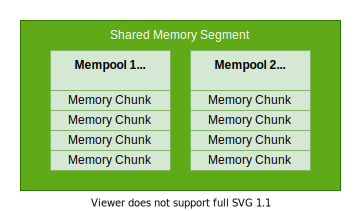

<!-- @todo Move the content of this file to doc/website/concepts/ -->

# Shared memory communication

## The basics

When a process in a POSIX system starts it is given its own virtual address space.

The range that a virtual address space spans may be the same for different processes, however the data that is
accessible at a particular address may be different for each process.

A pointer in an application uses the virtual address space of the process it is running in.

Within the virtual address space of a process there are a number of "memory areas" where data is loaded or mapped to.
These memory areas are typically disjointed ranges in the process's virtual address space.
Some examples of what may be in a memory area are:

* The execution instructions of the running program (i.e. the program's `.text` segment)
* Static variable declarations (i.e. the programs `.data` segment)
* The execution instructions of a shared library used by the running program (the libraries `.text` segment)
* The process's stack
* The process's heap
* Shared memory segments

A shared memory segment is physical memory that lies somewhere foreign to a process (i.e. in some section of RAM or on
the file system) that is made accessible via a mapping to a memory area in their virtual address space.

A single segment may be mapped to multiple processes, however the addresses to which it is mapped to may be
(and probably will be) different between processes.

The POSIX API provides the [utilities](http://man7.org/linux/man-pages/man7/shm_overview.7.html) for working with
shared memory segments.

## Organization

An iceoryx system utilizes one "management" segment for administration purposes and any number of "user" segments for
event communication between services.

These segments are logically partitioned into "mempools". Mempools contain a number of equally sized "memory chunks".

Memory chunks are the basic unit used for shared memory access in an iceoryx system.

The number of segments used by an iceoryx system, along with the configuration of the mempools they contain, are
provided to the system via configuration.

The configuration can be provided at compile time (as a header) or at runtime (as a toml-formatted text file).
See the [configuration guide](./website/advanced/configuration-guide.md#configuring-mempools-for-roudi) for more details.

## Zero-copy communication

`popo::Publisher`s / `popo::Subscriber`s and `popo::Server`s / `popo::Client`s which are connected can communicate
via shared memory resulting in zero-copy communication. In this section `popo::Publisher` and `popo::Server` will be
referred to as producers and `popo::Subscriber` and `popo::Client` as consumers.

A producer has an assigned shared memory segment to which it may write its data to.
In a POSIX system, this is decided purely based on file access permissions as memory segments are represented as
virtual files.

To output data, a producer reserves a memory chunk in its assigned memory segment.
The iceoryx system will choose the smallest chunk size that can fit the output data structure.
Note that an entire chunk is reserved even if the data type it contains is smaller than its size.

A producer chooses explicitly when to deliver data written in a memory chunk to all of its attached consumers
(established via discovery). When this occurs, a pointer to the memory chunk is placed on a receive queue at the
consumer.
The consumer can then access the data at its own convenience by following the pointer.

A consumer must explicitly indicate when it has finished processing a particular memory chunk it has received.
Memory chunks are returned to the pool once all attached consumers indicate they have finished.

### A Note on pointers

As already discussed, shared memory segments may be mapped to different memory areas in the virtual address space of a
process.
To deal with this, iceoryx utilizes specialized pointer types: the `iox::RelativePointer` and
the `iox::relocatable_ptr`.

Using these types, the difference in memory mapping is not a factor when it comes to locating a memory chunk.

A more detailed discussion about how these types work can be found
[here](design/relocatable_pointer.md).
