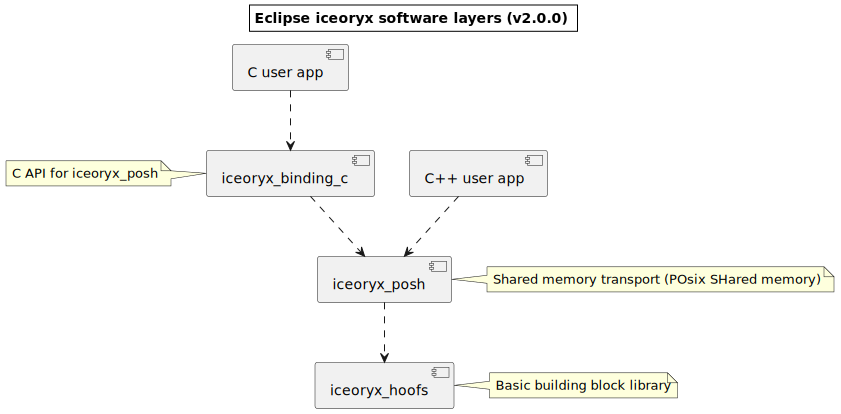
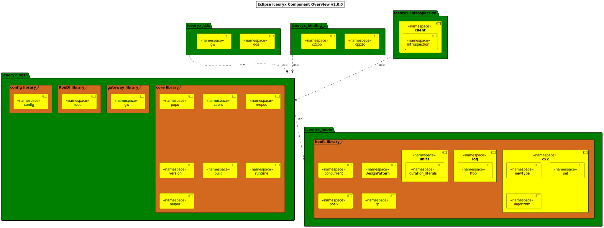

# Architecture

This article provides an overview of the Eclipse iceoryx architecture and explains the rationale for it.

## Software layers

The main packages which Eclipse iceoryx is composed of are depicted below.

The next sections briefly describe the components and their libraries one by one.

## Components and libraries

The different libraries and their namespaces are depicted below.

### iceoryx hoofs

Handy Objects Optimized For Safety (hoofs) is a library and contains various building blocks like fixed size containers,
concurrency classes and modern, next-gen C++ constructs from upcoming C++ standard releases.

For more information about the components, refer to its [detailed description](../../../iceoryx_hoofs/README.md).

### iceoryx posh

The package `iceoryx_posh` (**PO**SIX **SH**ared memory) contains everything related to shared memory inter-process communication.

#### Core library

This section describes the namespaces of the core library.

* `popo`: The namespace posh ports contains the user-API classes which are used to transfer data.
* `capro`: The namespace canonical protocol implements the [canonical protocol pattern](https://en.wikipedia.org/wiki/Canonical_protocol_pattern)
protocol, which is used by `iceoryx_posh` to connect and discover `popo::Publisher` and `popo::Server`.
* `mepoo`: The namespace memory pool contains all memory-related classes. For example the `MemoryManager` or `SharedPointer`.
* `version`: The namespace version contains ABI compatibilities checks.
* `build`: The namespace build contains certain maximium values which can be changed before compilation.

#### Gatway library

* The gateway library and its namespace `gw` contain generic abstractions to create a gateway. They are used by [`iceoryx_dds`](https://github.com/eclipse-iceoryx/iceoryx-gateway-dds).

#### RouDi library

* The library RouDi and its namespace `roudi` contains classes which are used by the RouDi middleware daemon.

### iceoryx C binding

The module `iceoryx_binding_c` makes the inter-process communication features of `iceoryx_posh` available in C.

### iceoryx DDS

The package `iceoryx_dds` provides a bi-directional DDS gateway using [Eclipse Cyclone DDS](https://cyclonedds.io/).
The gateway can be used to send data over a network e.g. via Ethernet.

For more information, refer to the [Readme](https://github.com/eclipse-iceoryx/iceoryx-gateway-dds/).

### iceoryx introspection

The introspection client can be used for live debugging and provides information of the current system like memory
usage and established connections.

For more information, refer to the [icecrystal example](../examples/icecrystal.md).
