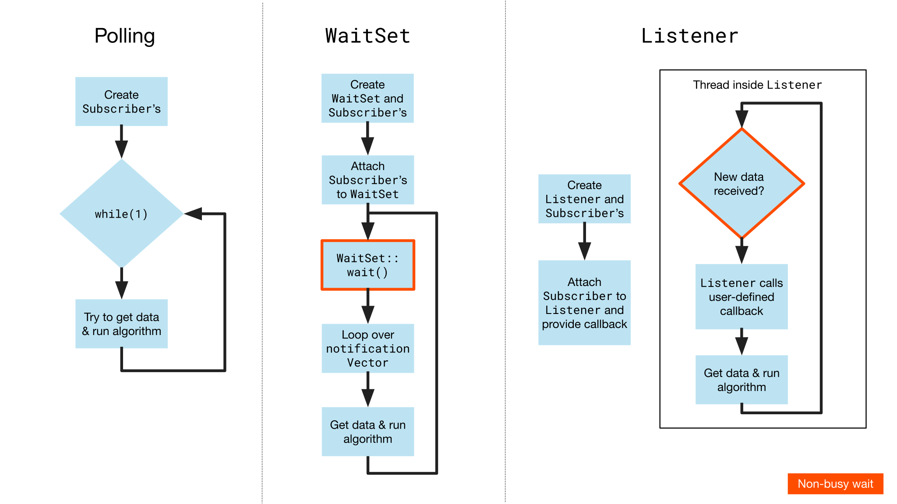

# Overview

This document covers the core functionality of Eclipse iceoryx and is intended to
provide a quick introduction to setting up iceoryx applications.

## General

To set up a collection of applications using iceoryx (an _iceoryx system_), the applications need to initialize a
runtime and create communication participants like _publishers_ and _subscribers_ or _clients_ and _servers_.
Publishers send data of a specific _topic_ which can be received by subscribers of the same topic. Servers wait
on a topic for requests from clients and respond to these requests. To enable the operation of these participants,
the middleware daemon, called `RouDi`, must be running.

But before we get into more details, let's start with a simple publish-subscribe example.

### A first example

We need to create a runtime with a unique name along all applications for each application to enable communication with
RouDi.

```cpp
iox::runtime::PoshRuntime::initRuntime("some_unique_name");
```

Now this application is ready to communicate with RouDi and we can define the data type we want to send.

```cpp
struct CounterTopic
{
    uint32_t counter;
};
```

Then we create a publisher that offers our CounterTopic.

```cpp
iox::popo::Publisher<CounterTopic> publisher({"Group", "Instance", "CounterTopic"});
```

Now we can use the publisher to send the data.

```cpp
auto result = publisher.loan();
if(result.has_value())
{
    auto& sample = result.value();
    sample->counter = 30;
    sample.publish();
}
else
{
    // handle the error
}
```

Here `result` is an `iox::expected` and hence we may get an error. This can happen if we try to loan too many samples
and exhaust memory. We have to handle this potential error since the expected class has the `nodiscard` keyword
attached. This means we get a warning (or an error when build in strict mode) when we don't handle it. We could
also explicitly discard it with `IOX_DISCARD_RESULT` which is discouraged. If you want to know more about
`iox::expected`, take a look at
[How optional and error values are returned in iceoryx](../concepts/how-optional-and-error-values-are-returned-in-iceoryx.md).
Let's create a corresponding subscriber.

```cpp
iox::popo::Subscriber<CounterTopic> subscriber({"Group", "Instance", "CounterTopic"});
```

Now we can use the subscriber to receive data. For simplicity, we assume that we periodically check for new data. It
is also possible to explicitly wait for data using the [WaitSet](../../../iceoryx_examples/waitset/README.md) or
the [Listener](../../../iceoryx_examples/callbacks/README.md). The code to receive the data is the same, the only difference is the way we wake up before checking for data.

```cpp
while (keepRunning)
{
    // wait for new data (either sleep and wake up periodically or by notification from the waitset)

    auto result = subscriber.take();

    if(result.has_value())
    {
        auto& sample = result.value();
        uint32_t counter = sample->counter;
        //process the data
    }
    else
    {
        //handle the error
    }

    std::this_thread::sleep_for(std::chrono::milliseconds(100));
}
```

By calling `take` we get an `expected` and hence we have to handle the potential error.

And that's it. We have created our first simple iceoryx example.
[Here](../../../iceoryx_examples/README.md) you can find further examples
which demonstrate how iceoryx can be used and describe our API in more detail.

Now that we have applications capable of sending and receiving data, we can run the complete iceoryx system.

!!! note
    RouDi and all Apps have to be built with the same compiler and the same compiler flags.

First we need to start RouDi.

```bash
# If installed and available in PATH environment variable
iox-roudi
# If build from scratch with script in tools
$ICEORYX_ROOT/build/iox-roudi
```

Afterwards, we can start the applications which immediately connect to the RouDi via their runtime.

When the application terminates, the runtime cleans up all resources needed for communication with RouDi. This
includes all memory chunks used for the data transmission which may still be held by the application.

Before going into the details in the next sections, the following animation depicts the course of events.


We now briefly define the main entities of an iceoryx system which were partially already used in the example above.

### RouDi

RouDi is an abbreviation for **Rou**ting and **Di**scovery. RouDi takes care of the communication setup but does not
actually participate in the communication between the publisher and the subscriber or the client and the server.
RouDi can be thought of as the switchboard operator of iceoryx. One of its other major tasks is the setup of the
shared memory, which the applications use for exchanging payload data. Sometimes referred to as daemon, RouDi
manages the shared memory and is responsible for the service discovery, i.e. enabling subscribers/clients to find
topics offered by publishers/servers. It also keeps track of all applications which have initialized a runtime and
are hence able to create publishers, subscribers, servers or clients. It provides facilities for applications to
query this information.

When an application crashes, RouDi cleans up all resources. Due to our mostly lock-free inter-process mechanisms
(only one last lock; we are working to remove it), iceoryx-based communication is much more reliable compared to
traditional mechanism using locking.

To view the available command line options for RouDi call `$ICEORYX_ROOT/build/iox-roudi --help`.

### Shared memory

To enable zero-copy inter-process communication, iceoryx uses the shared memory approach, i.e. publishers and
subscribers or clients and servers can communicate via shared memory resulting in zero-copy communication.

Shared memory is physical memory that is made accessible to multiple processes via a mapping to a memory area in their
virtual address spaces.

For further information have a look at our
[shared memory concept article](../../shared-memory-communication.md).

### Runtime

Each application that wants to use iceoryx has to instantiate its runtime, which essentially enables communication
with RouDi.

To do so, the following lines of code are required

```cpp
iox::runtime::PoshRuntime::initRuntime("some_unique_application_name");
```

The runtime is an object inside the user application that maps the shared memory into the user
application's address space.

!!! note
    Only one runtime object per user application is allowed.

### Creating service descriptions for topics

A `ServiceDescription` in iceoryx represents a topic under which publishers and subscribers or clients and servers
can exchange data and is uniquely identified by three string identifiers.

1. `Group` name
2. `Instance` name
3. `Topic` name

A triple consisting of such strings is called a `ServiceDescription`. Two `ServiceDescription`s are considered
matching if all these three strings are element-wise equal, i.e. group, instance and topic names are the same for both
of them. This means the group and instance identifier can be ignored to create different `ServiceDescription`s. They
will be needed for advanced filtering functionality in the future.

The service model of iceoryx is derived from AUTOSAR and is still used in the API with these names (`Service`,
`Instance`, `Event`). The so called canonical protocol is implemented in the namespace `capro`.

The following table gives an overview of the different terminologies and the current mapping:

|                                                                                   | Group   | Instance         | Topic                  |
|-----------------------------------------------------------------------------------|---------|------------------|------------------------|
| [rmw_iceoryx](https://github.com/ros2/rmw_iceoryx/)                               | Type    | Namespace/Topic  | -                      |
| AUTOSAR                                                                           | Service | Instance         | Event                  |
| [DDS Gateway](https://github.com/eclipse-iceoryx/iceoryx-gateway-dds/)            | -       | -                | /Group/Instance/Topic  |
| [Cyclone DDS](https://github.com/ros2/rmw_cyclonedds)                             | -       | Type Name        | Topic Name             |

Service is related to instance like classes are related to objects in C++. A service describes an abstract topic and an
instance is one instantiation of that abstraction, like an object is an instantiated class. Events are in this context
like members of a class.

Example:

```cpp
class MyRadarService {
   public:
      bool hasObstacleDetected;
      float distanceToObstacle;
};

MyRadarService frontLeftRadarInstance;
std::cout << frontLeftRadarInstance.hasObstacleDetected << std::endl;
```

In the iceoryx world, we would for instance subscribe to the service
`("MyRadarService", "frontLeftRadarInstance", "hasObstacleDetected")` and would receive a sample whenever
an obstacle was detected. Or we would subscribe to `distanceToObstacle` and would receive a constant stream
of data which presents the distance to the obstacle.

#### Restrictions

The data type of the transmitted data can be any C++ class, struct or plain old data type as long as it satisfies the
following conditions:

- no heap is used
- the data structure is entirely contained in the shared memory - no pointers to process local memory, no references
to process local constructs, no dynamic allocators
- the data structure has to be relocatable and therefore must not internally use pointers/references
- no virtual member functions
- must not rely on the destructor being called

!!! note
    The sample might be released from a process without write access to the shared memory. Therefore the
    destructor is not called when a sample is released. All data types must be either trivially destructible or must
    at least not rely on the destructor being called. The latter is the case for the iceoryx containers like
    `cxx::vector` where only the inner type must be trivially destructible.

!!! info
    Most of the STL types cannot be used, but some are reimplemented to meet the conditions above.
    You can find an overview [here](../../../iceoryx_hoofs/README.md#cxx).

### Publisher

A publisher is tied to a topic and needs a service description to be constructed. If it is typed, one needs to
additionally specify the data type as a template parameter. Otherwise, the publisher is only aware of raw memory and
the user has to ensure that it is interpreted correctly.

Once it has offered its topic, it is able to publish (send) data of the specific type. Note that the default is to
have multiple publishers for the same topic (n:m communication). A compile-time option to restrict iceoryx to
1:n communication is available. Should 1:n communication be used, RouDi checks for multiple publishers on the same
topics and raises an error if there is more than one publisher for a topic.

### Subscriber

Symmetrically a subscriber also corresponds to a topic and thus needs a service description to be constructed. As for
publishers we distinguish between typed and untyped subscribers.

Once a subscriber is subscribed to some topic, it is able to receive data of the type tied to this topic. In the
untyped case this is raw memory and the user must take care that it is interpreted in a way that is compatible to the
data that was actually sent.

When multiple publishers have offered the same topic the subscriber will receive the data of all of them (but in
indeterminate order between different publishers). Note that the subscriber will not receive data from servers or
clients, even when they use the same topic.

### Client

Similar to publishers and subscribers, clients are tied to a topic and need a service description to be constructed.
If the client is typed, one needs to specify the request and response data types as template parameters. In the
untyped case, the client is only aware of raw memory and the user has to take care of its correct interpretation.

Once a client is connected to a server, it can send requests to and receive responses from the server. A sequence
ID is used to match a response to a specific request. It must be set on request and checked on response by the user.

### Server

Like a client, a server needs a service description to be constructed and can be typed or untyped. In the typed
case, the user has to provide the request and the response data types as template parameters. Otherwise, the server
handles raw memory and the user has to ensure that it is interpreted correctly.

Once connected, the server can receive requests from clients and send the corresponding responses.

## Avoid polling

The easiest way to receive data is to periodically poll whether data is available as depicted on the left side of the
picture below for the publish-subscribe messaging pattern. This is sufficient for simple use cases but inefficient in
general, as it often leads to unnecessary latency and wake-ups without data. An alternative approach to receive data
is to wait for user-defined events to occur. This is provided by our `WaitSet` and `Listener` which are introduced in
the following sections.



### WaitSet

The WaitSet can be used to relinquish control by putting the thread to sleep with a non-busy wait and wait for
user-defined events to occur. Usually, these events correspond to the availability of data at specific subscribers
or clients. This way we can immediately wake up when data is available and avoid unnecessary wake-ups if no data
is available.

One typical use case is to create a WaitSet, attach multiple subscribers and/or clients and user triggers and then
wait until one or many of the attached objects signal an event. If this happens one receives a list of all occured
events called `notificationVector`. This makes it possible to collect data directly from the subscriber or client
when it signals the WaitSet that new data or a new response is available.

The WaitSet uses the [reactor pattern](https://en.wikipedia.org/wiki/Reactor_pattern) and is informed with a push
strategy that one of the attached events occured at which it informs the user.

For more information on how to use the WaitSet see our
[WaitSet examples](../../../iceoryx_examples/waitset).

### Listener

The Listener can be used to connect custom callbacks to user-defined events. Unlike the WaitSet, it reacts to those
events by executing the connected custom callbacks in a background thread, that will be created by the Listener.
As with the WaitSet the background thread waits non-busy on the reception of new data.

!!! note
    The Listener is completely thread-safe but please be aware that most of the objects which can be attached to the
    Listener are not thread-safe! This means either the object is handled solely by the Listener, which should be the
    most common use case, or the user has to ensure the thread safety with other means like encapsulating the object in
    a thread-safe class.

One use case could be that one creates a Listener and attaches multiple subscribers. Every time new data is available,
the corresponding connected callback will be executed, e.g. print something to the console or calculate an algorithm.
Another use case could be that a server is attached to the Listener and every time a request is received, the
connected callback that creates and sends a response, is executed.

Like the WaitSet, the Listener uses the reactor pattern.

For more information about the Listener see our
[callbacks example](../../../iceoryx_examples/callbacks).

## API

The API is offered in two languages, C++ and C. Detailed information can be found in the
[C++ example](../../../iceoryx_examples/icedelivery) and
[C example](../../../iceoryx_examples/icedelivery_in_c).

Many parts of the C++ API follow a functional programming approach which is less error-prone. This requires using
the monadic types `iox::expected` and `iox::optional` which are introduced
[here](../concepts/how-optional-and-error-values-are-returned-in-iceoryx.md).

With the C++ API, we distinguish between the `typed API` and the `untyped API`. In the typed API, the underlying
data type is made apparent by typed pointers or references to some data type T (often a template parameter). This allows
working with the data in a C++ idiomatic and type-safe way and should be preferred whenever possible. The typed API is
mainly used when iceoryx is used stand-alone, i.e. not integrated into a third party framework.

The untyped API provides [opaque](https://en.wikipedia.org/wiki/Opaque_pointer) (i.e. void) pointers to data, which
is flexible and efficient but also requires that the user takes care to interpret received data correctly, i.e. as
a type compatible to what was actually sent. This is required for interaction with other lower level APIs and
integration into third party frameworks such as [ROS](https://www.ros.org/). For further information see the
respective header files.
